# Manual de Usuario — Pi Orchestrator

**Versión:** 0.1.0  
**Última actualización:** 2026-07-04  
**Audiencia:** Desarrolladores que usan Pi Agent

---

## Índice

1. [¿Qué es Pi Orchestrator?](#1-qué-es-pi-orchestrator)
2. [Requisitos Previos](#2-requisitos-previos)
3. [Instalación](#3-instalación)
4. [Verificación de Instalación](#4-verificación-de-instalación)
5. [Conceptos Clave](#5-conceptos-clave)
6. [Primer Uso](#6-primer-uso)
7. [Referencia del Comando /orchestrate](#7-referencia-del-comando-orchestrate)
8. [Crear un plan.md](#8-crear-un-planmd)
9. [Configuración de Modelos](#9-configuración-de-modelos)
10. [Ejemplos Prácticos](#10-ejemplos-prácticos)
11. [TUI Dashboard](#11-tui-dashboard)
12. [Atajos de Teclado](#12-atajos-de-teclado)
13. [Manejo de Errores](#13-manejo-de-errores)
14. [Preguntas Frecuentes](#14-preguntas-frecuentes)
15. [Solución de Problemas](#15-solución-de-problemas)

---

## 1. ¿Qué es Pi Orchestrator?

Pi Orchestrator es un sistema de orquestación multi-agente que ejecuta tareas en paralelo usando subagentes aislados.

### Problema que resuelve

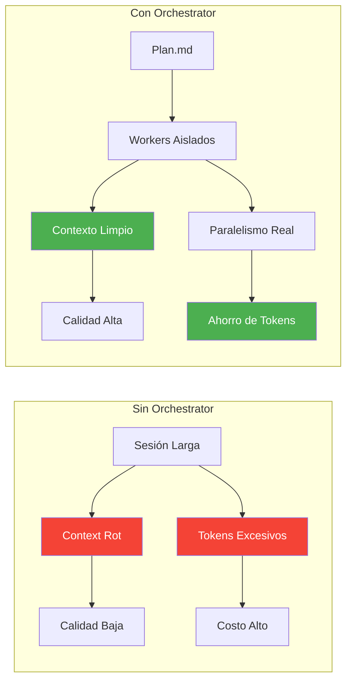

### Beneficios

| Beneficio | Descripción |
|---|---|
| **Sin Context Rot** | Cada worker empieza con contexto limpio |
| **Paralelismo** | Múltiples tareas se ejecutan simultáneamente |
| **Ahorro de Tokens** | Reducción del 40-60% vs ejecución secuencial |
| **Observabilidad** | Dashboard en tiempo real con métricas |
| **Control** | Pausar, cancelar, reanudar tareas |

---

## 2. Requisitos Previos

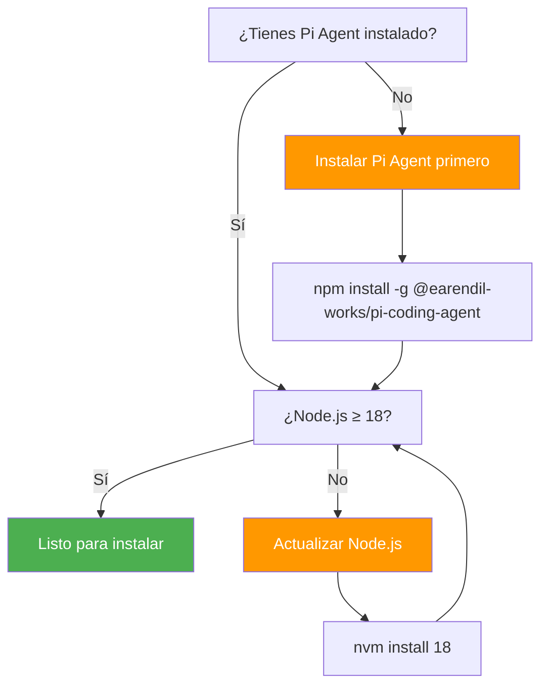

### Requisitos mínimos

| Componente | Versión Mínima | Verificar |
|---|---|---|
| Node.js | 18.0.0 | `node --version` |
| npm | 9.0.0 | `npm --version` |
| Pi Agent | Última | `pi --version` |
| Git | 2.0.0 | `git --version` |

---

## 3. Instalación

### Opción A: Desde GitHub (Recomendado)

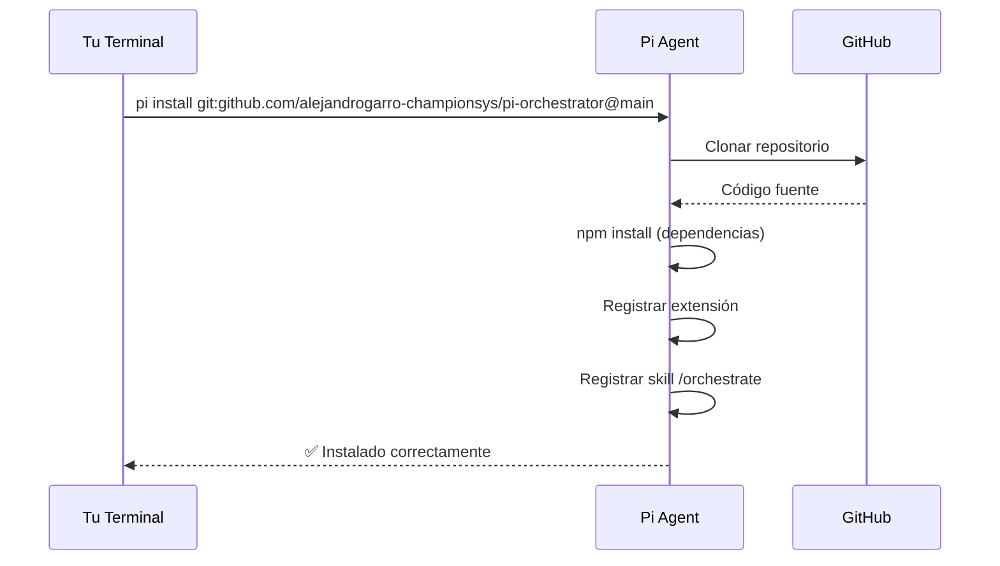

**Ejecuta:**

```bash
pi install git:github.com/alejandrogarro-championsys/pi-orchestrator@main
```

### Opción B: Local (Desarrollo)

Si tienes el código localmente:

```bash
# Clonar el repositorio
git clone https://github.com/alejandrogarro-championsys/pi-orchestrator.git
cd pi-orchestrator

# Instalar como paquete local
pi install .
```

### Opción C: npm (cuando esté publicado)

```bash
pi install npm:@pi-orch/orchestrator@0.1.0
```

---

## 4. Verificación de Instalación

### Paso 1: Verificar que el paquete está instalado

```bash
pi list
```

Salida esperada:
```
Installed packages:
  git:github.com/alejandrogarro-championsys/pi-orchestrator@main
```

### Paso 2: Verificar que la skill está disponible

```bash
# Iniciar Pi Agent
pi

# En la terminal de Pi, escribir:
/orchestrate --help
```

Deberías ver la ayuda del comando.

### Paso 3: Verificar la extensión

```bash
pi --list-extensions
```

Debería mostrar:
```
Extensions:
  @pi-orch/orchestrator (git:github.com/...)
```

---

## 5. Conceptos Clave

### Arquitectura del Sistema

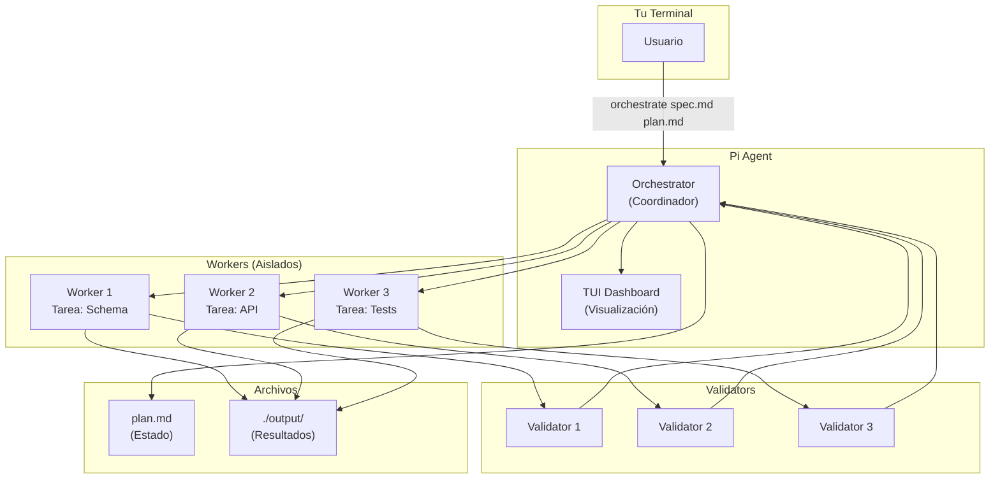

### Ciclo de Vida de una Tarea

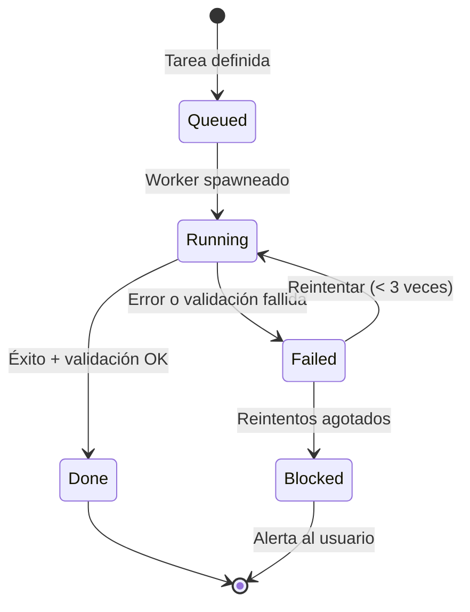

### Tiers de Modelo

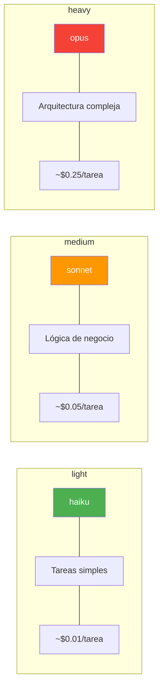

---

## 6. Primer Uso

### Paso 1: Crear spec.md

Crea un archivo `spec.md` con la especificación de tu proyecto:

```markdown
# Especificación: Módulo de Autenticación

## Requisitos
- Login con email y password
- Registro de nuevos usuarios
- Refresh tokens
- Rate limiting

## Endpoints
- POST /api/auth/login
- POST /api/auth/register
- POST /api/auth/refresh

## Reglas de Negocio
- Password mínimo 8 caracteres
- Email debe ser válido
- Tokens expiran en 24h
```

### Paso 2: Crear plan.md

Crea un archivo `plan.md` con el plan de implementación:

```markdown
---
version: "1.0"
plan_id: "plan-auth-module"
status: "queued"

models:
  light: haiku
  medium: sonnet
  heavy: opus

config:
  max_concurrent_workers: 4
  max_retries: 3
  timeout_per_task_ms: 300000

tasks:
  - id: "task-001"
    title: "Definir schema de usuarios"
    tier: "light"
    dependencies: []
    prompt: "Crear schema TypeScript con zod para usuario"

  - id: "task-002"
    title: "Crear migración SQL"
    tier: "medium"
    dependencies: ["task-001"]
    prompt: "Crear migración SQL para tabla users"

  - id: "task-003"
    title: "Implementar endpoints"
    tier: "medium"
    dependencies: ["task-001", "task-002"]
    prompt: "Implementar endpoints de autenticación"

  - id: "task-004"
    title: "Tests unitarios"
    tier: "light"
    dependencies: ["task-003"]
    prompt: "Crear tests unitarios para auth"

  - id: "task-005"
    title: "Tests de integración"
    tier: "heavy"
    dependencies: ["task-003"]
    prompt: "Crear tests de integración completos"
---

# Descripción del Módulo

Módulo de autenticación completo con JWT y refresh tokens.
```

### Paso 3: Ejecutar

```bash
# En Pi Agent
/orchestrate spec.md plan.md
```

---

## 7. Referencia del Comando /orchestrate

### Sintaxis

```text
/orchestrate <spec.md> <plan.md> [opciones]
```

### Parámetros Obligatorios

| Parámetro | Tipo | Descripción |
|---|---|---|
| `spec.md` | Archivo | Documento de especificación del negocio |
| `plan.md` | Archivo | Plan de implementación con YAML frontmatter |

### Parámetros Opcionales

| Opción | Alias | Tipo | Default | Descripción |
|---|---|---|---|---|
| `--models <config>` | `-m` | String | Ver §9 | Asignación de modelos por tier |
| `--concurrency <n>` | `-c` | Number | `4` | Máximo de workers concurrentes |
| `--timeout <ms>` | `-t` | Number | `300000` | Timeout por tarea (ms) |
| `--retries <n>` | `-r` | Number | `3` | Reintentos máximos por tarea |
| `--dry-run` | `-d` | Flag | `false` | Solo parsear, no ejecutar |
| `--resume` | | Flag | `false` | Reanudar plan existente |
| `--output <dir>` | `-o` | String | `./output/` | Directorio de salida |

### Ejemplos de Uso

```bash
# Básico
/orchestrate spec.md plan.md

# Con modelos personalizados
/orchestrate spec.md plan.md --models light=haiku,medium=sonnet,heavy=opus

# Solo vista previa
/orchestrate spec.md plan.md --dry-run

# Máxima concurrencia
/orchestrate spec.md plan.md --concurrency 8

# Timeout extendido para tareas pesadas
/orchestrate spec.md plan.md --timeout 600000

# Combinar opciones
/orchestrate spec.md plan.md --models medium=opus --concurrency 6 --retries 5
```

---

## 8. Crear un plan.md

### Estructura del YAML Frontmatter

```yaml
---
# Metadatos
version: "1.0"
plan_id: "plan-unico-identifier"
created_at: "2026-07-04T10:00:00Z"
status: "queued"  # queued | in_progress | completed | blocked | failed

# Configuración de modelos
models:
  light: haiku      # Modelo para tareas simples
  medium: sonnet    # Modelo para tareas intermedias
  heavy: opus       # Modelo para tareas complejas

# Configuración de ejecución
config:
  max_concurrent_workers: 4    # Workers simultáneos
  max_retries: 3               # Reintentos por tarea
  timeout_per_task_ms: 300000  # 5 minutos por tarea

# Presupuesto de tokens (opcional)
token_budget:
  total_limit: 500000
  by_tier:
    light:
      limit: 100000
      warning_threshold: 80000
    medium:
      limit: 300000
      warning_threshold: 240000
    heavy:
      limit: 100000
      warning_threshold: 80000

# Lista de tareas
tasks:
  - id: "task-001"
    title: "Nombre de la tarea"
    tier: "light"              # light | medium | heavy
    model: "haiku"             # Override explícito (opcional)
    dependencies: []           # IDs de tareas dependientes
    prompt: "Instrucción detallada para el worker"
    timeout_ms: 300000         # Override del timeout global
---
```

### Grafo de Dependencias

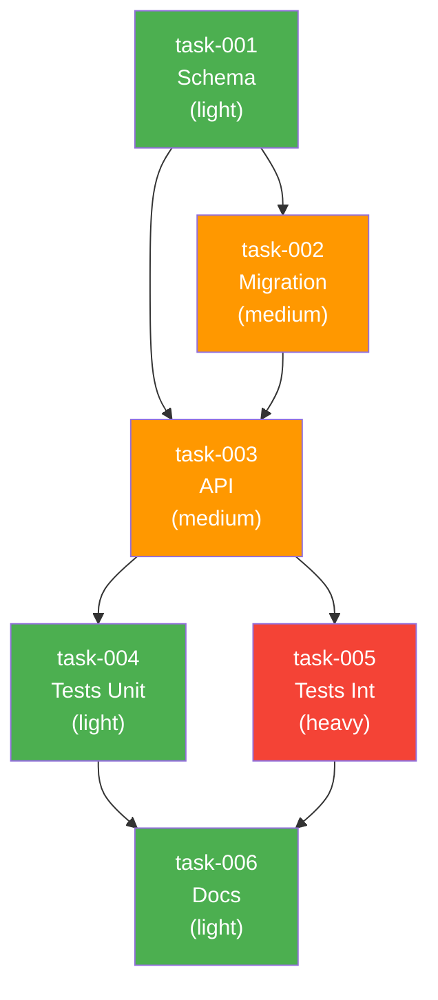

### Formato del Markdown (después del YAML)

```markdown
---

# Nombre del Proyecto

## Descripción
[Descripción general del proyecto]

## Requisitos
- Requisito 1
- Requisito 2

## Endpoints
- GET /api/resource
- POST /api/resource

## Reglas de Negocio
- Regla 1
- Regla 2

## No Hacer
- Evitar X
- No implementar Y
```

---

## 9. Configuración de Modelos

### Prioridad de Configuración

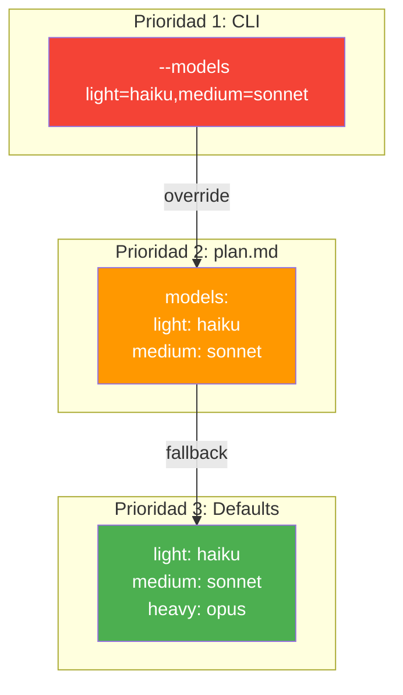

### Sintaxis CLI

```bash
# Formato completo
--models light=haiku,medium=sonnet,heavy=opus

# Solo sobreescribir un tier
--models medium=opus

# Múltiples opciones
--models light=haiku,medium=sonnet
```

### Sintaxis YAML

```yaml
models:
  light: haiku
  medium: sonnet
  heavy: opus
```

### Modelos Disponibles por Tier

| Tier | Modelos Válidos | Default | Caso de Uso |
|---|---|---|---|
| `light` | `haiku`, `sonnet` | `haiku` | CRUD, config, docs |
| `medium` | `sonnet`, `opus` | `sonnet` | APIs, lógica, tests |
| `heavy` | `opus` | `opus` | Arquitectura, crypto |

### Override por Tarea

Puedes forzar un modelo específico en cada tarea:

```yaml
tasks:
  - id: "task-001"
    title: "Tarea crítica"
    tier: "heavy"
    model: "opus"  # Forzado: siempre opus
    dependencies: []
```

---

## 10. Ejemplos Prácticos

### Ejemplo 1: CRUD API Simple

**spec.md:**
```markdown
# API CRUD para Usuarios

## Endpoints
- GET /api/users
- GET /api/users/:id
- POST /api/users
- PUT /api/users/:id
- DELETE /api/users/:id
```

**plan.md:**
```yaml
---
version: "1.0"
plan_id: "plan-crud-users"
status: "queued"

models:
  light: haiku
  medium: sonnet

config:
  max_concurrent_workers: 4
  max_retries: 3
  timeout_per_task_ms: 300000

tasks:
  - id: "task-001"
    title: "Definir schema de usuario"
    tier: "light"
    dependencies: []
    prompt: "Crear schema TypeScript con zod para usuario con campos: id, name, email, createdAt"

  - id: "task-002"
    title: "Crear endpoints CRUD"
    tier: "medium"
    dependencies: ["task-001"]
    prompt: "Implementar endpoints CRUD para usuarios usando Express"

  - id: "task-003"
    title: "Tests unitarios"
    tier: "light"
    dependencies: ["task-002"]
    prompt: "Crear tests unitarios para cada endpoint"
---

# API CRUD para Usuarios
API RESTful para gestión de usuarios con validación y tests.
```

**Ejecución:**
```bash
/orchestrate spec.md plan.md
```

### Ejemplo 2: Módulo Completo de Autenticación

**plan.md:**
```yaml
---
version: "1.0"
plan_id: "plan-auth-complete"
status: "queued"

models:
  light: haiku
  medium: sonnet
  heavy: opus

config:
  max_concurrent_workers: 4
  max_retries: 3
  timeout_per_task_ms: 300000

tasks:
  # Fase 1: Base de datos
  - id: "task-001"
    title: "Schema de usuarios"
    tier: "light"
    dependencies: []
    prompt: "Crear schema con zod: id, email, passwordHash, refreshTokens[], createdAt, updatedAt"

  - id: "task-002"
    title: "Migración SQL"
    tier: "medium"
    dependencies: ["task-001"]
    prompt: "Crear migración SQL para tabla users con índices en email"

  # Fase 2: Lógica de negocio
  - id: "task-003"
    title: "Servicio de autenticación"
    tier: "heavy"
    dependencies: ["task-001", "task-002"]
    prompt: "Implementar AuthService con login, register, refreshToken, logout. Usar bcrypt y JWT."

  # Fase 3: Endpoints
  - id: "task-004"
    title: "Endpoints de auth"
    tier: "medium"
    dependencies: ["task-003"]
    prompt: "Crear endpoints POST /auth/login, /auth/register, /auth/refresh, /auth/logout"

  # Fase 4: Tests
  - id: "task-005"
    title: "Tests unitarios"
    tier: "light"
    dependencies: ["task-004"]
    prompt: "Tests unitarios para AuthService y cada endpoint"

  - id: "task-006"
    title: "Tests de integración"
    tier: "heavy"
    dependencies: ["task-004"]
    prompt: "Tests de integración completos: login exitoso, fallido, refresh token, logout"
---

# Módulo de Autenticación
Sistema completo de autenticación con JWT y refresh tokens.
```

**Ejecución:**
```bash
/orchestrate spec.md plan.md --concurrency 4
```

### Ejemplo 3: Dry Run (Vista Previa)

```bash
/orchestrate spec.md plan.md --dry-run
```

Salida esperada:
```
📋 Plan: plan-auth-complete
📊 Tareas: 6
⏱️  Tiempo estimado: ~12 minutos
💰 Costo estimado: ~$0.45

Fase 1: Base de datos
  ✅ task-001: Schema de usuarios (light → haiku)
  ⏳ task-002: Migración SQL (medium → sonnet)

Fase 2: Lógica
  ⏳ task-003: Servicio de autenticación (heavy → opus)

Fase 3: Endpoints
  ⏳ task-004: Endpoints de auth (medium → sonnet)

Fase 4: Tests
  ⏳ task-005: Tests unitarios (light → haiku)
  ⏳ task-006: Tests de integración (heavy → opus)

¿Continuar? [y/N]
```

---

## 11. TUI Dashboard

### Layout del Dashboard

```text
┌─────────────────────────────────────────────────────────────────────┐
│  🐙 PI ORCHESTRATOR                                   [F1] Help   │
├─────────────────────────────────────────────────────────────────────┤
│  Plan: auth-module              Status: ▶ In Progress               │
│  Tasks: 3/6 done   Workers: 2 active   Elapsed: 00:05:23          │
├─────────────────────────────────────────────────────────────────────┤
│                                                                     │
│  Phase 1: Database Layer                                            │
│  ┌─────────────────────────────────────────────────────────────┐   │
│  │ ✅ T-001  Schema usuarios         light   haiku    0.4s    │   │
│  │ 🔄 T-002  Migración SQL           medium  sonnet   ...     │   │
│  └─────────────────────────────────────────────────────────────┘   │
│                                                                     │
│  Phase 2: Business Logic                                            │
│  ┌─────────────────────────────────────────────────────────────┐   │
│  │ ⏳ T-003  Auth Service           heavy   opus     queue   │   │
│  └─────────────────────────────────────────────────────────────┘   │
│                                                                     │
│  Phase 3: API Layer                                                 │
│  ┌─────────────────────────────────────────────────────────────┐   │
│  │ ⏳ T-004  Endpoints              medium  sonnet   queue   │   │
│  └─────────────────────────────────────────────────────────────┘   │
│                                                                     │
│  Phase 4: Testing                                                   │
│  ┌─────────────────────────────────────────────────────────────┐   │
│  │ ⏳ T-005  Tests unitarios        light   haiku    queue   │   │
│  │ ⏳ T-006  Tests integración      heavy   opus     queue   │   │
│  └─────────────────────────────────────────────────────────────┘   │
│                                                                     │
├─────────────────────────────────────────────────────────────────────┤
│  📊 Tokens: O:2.1k │ W:15.3k │ V:3.2k │ Total: 20.6k/500k        │
│  🕐 ETA: ~7min │ Speed: 1.1 tasks/min                              │
├─────────────────────────────────────────────────────────────────────┤
│  [c] Cancel  [p] Pause  [r] Resume  [Enter] Drill  [q] Quit       │
└─────────────────────────────────────────────────────────────────────┘
```

### Leyenda de Estados

| Icono | Estado | Significado |
|---|---|---|
| ✅ | Done | Tarea completada exitosamente |
| 🔄 | Running | Worker ejecutando |
| ⏳ | Queued | Esperando dependencias |
| 🚫 | Blocked | Circuit breaker activado |
| ❌ | Cancelled | Cancelada por usuario |

### Métricas en Tiempo Real

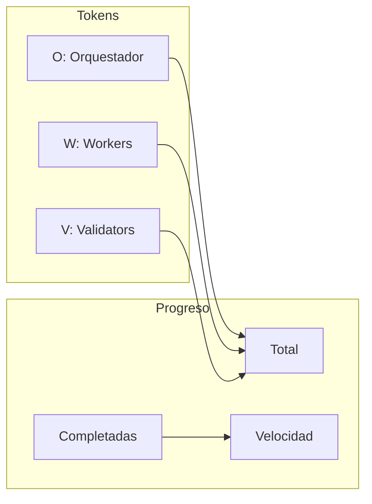

---

## 12. Atajos de Teclado

### Navegación

| Tecla | Acción |
|---|---|
| `↑` / `↓` | Mover cursor entre tareas |
| `←` / `→` | Expandir/colapsar fase |
| `Enter` | Drill-down en tarea seleccionada |
| `Esc` | Volver a vista de árbol |

### Control de Tareas

| Tecla | Acción | Confirmación |
|---|---|---|
| `c` | Cancelar tarea | Sí |
| `p` | Pausar tarea | No |
| `r` | Reanudar tarea | No |
| `d` | Drill-down (ver logs) | No |

### Sistema

| Tecla | Acción |
|---|---|
| `q` | Salir del orchestrator |
| `?` | Mostrar ayuda |
| `s` | Alternar vista de estadísticas |

### Flujo de Cancelación

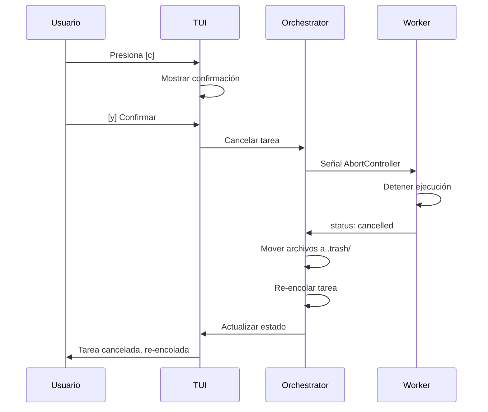

---

## 13. Manejo de Errores

### Circuit Breaker

Si una tarea falla 3 veces consecutivas:

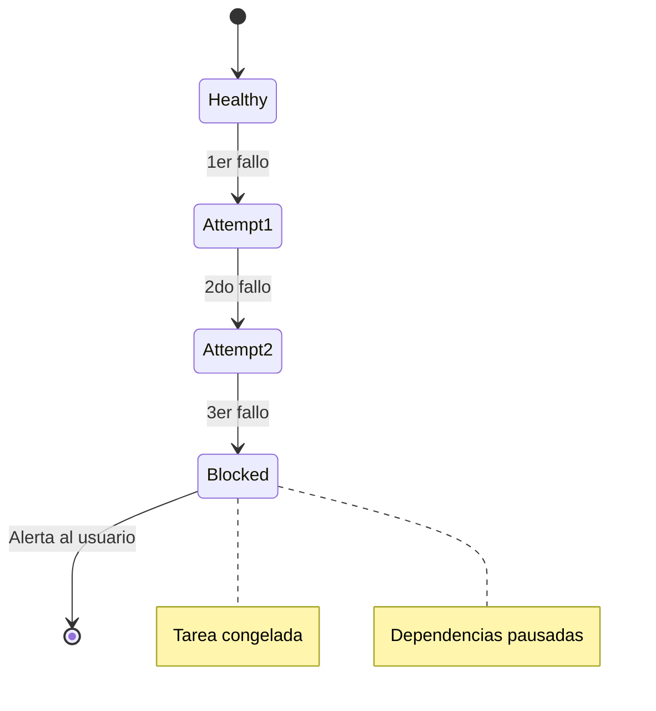

### Errores Comunes

| Error | Causa | Solución |
|---|---|---|
| `Archivo no encontrado` | Ruta incorrecta | Verificar con `ls *.md` |
| `YAML inválido` | Sintaxis incorrecta | Revisar indentación |
| `Dependencias cíclicas` | Tareas se dependen mutuamente | Revisar `dependencies` |
| `Timeout excedido` | Tarea muy larga | Aumentar `--timeout` |
| `Modelo no disponible` | Modelo incorrecto | Usar: haiku, sonnet, opus |

### Recuperación de Errores

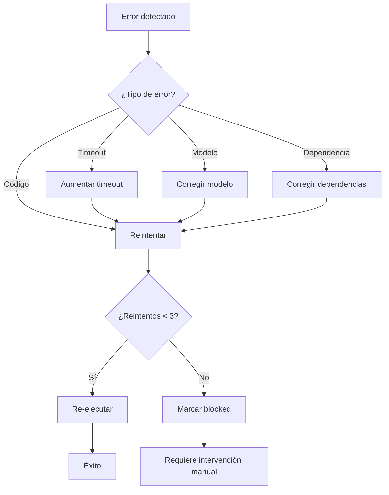

---

## 14. Preguntas Frecuentes

### ¿Cuántos workers puedo ejecutar simultáneamente?

Por defecto: 4. Puedes cambiarlo con `--concurrency`:

```bash
/orchestrate spec.md plan.md --concurrency 8
```

**Recomendación:** No exceder 8 workers por limitaciones de la API de LLM.

### ¿Qué pasa si un worker falla?

El orchestrator reintenta automáticamente hasta 3 veces. Si falla 3 veces:
1. La tarea se marca como `blocked`
2. Las dependencias se pausan
3. Se muestra una alerta en el TUI
4. Puedes cancelar o reintentar manualmente

### ¿Puedo pausar y reanudar?

Sí. Usa:
- `p` para pausar
- `r` para reanudar

El estado se preserva en `plan.md`.

### ¿Qué modelos puedo usar?

| Tier | Modelos |
|---|---|
| light | haiku, sonnet |
| medium | sonnet, opus |
| heavy | opus |

### ¿Cuánto cuesta?

Depende del tier y número de tareas:

| Tier | Costo estimado por tarea |
|---|---|
| light | ~$0.01 |
| medium | ~$0.05 |
| heavy | ~$0.25 |

Para un plan de 6 tareas (2 light, 2 medium, 2 heavy): ~$0.62

---

## 15. Solución de Problemas

### La skill /orchestrate no aparece

```bash
# Reinstalar
pi remove git:github.com/alejandrogarro-championsys/pi-orchestrator
pi install git:github.com/alejandrogarro-championsys/pi-orchestrator@main

# Recargar Pi
/reload
```

### Error "YAML inválido"

Verifica que tu plan.md tenga el formato correcto:

```yaml
---
version: "1.0"
plan_id: "mi-plan"
status: "queued"

models:
  light: haiku
  medium: sonnet
  heavy: opus

tasks:
  - id: "task-001"
    title: "Mi tarea"
    tier: "light"
    dependencies: []
---
```

**Errores comunes:**
- Falta `---` al inicio y final del YAML
- Indentación incorrecta (usa 2 espacios)
- Campos faltantes (`id`, `title`, `tier`, `dependencies`)

### Error "Dependencias cíclicas"

Verifica que no haya dependencias circulares:

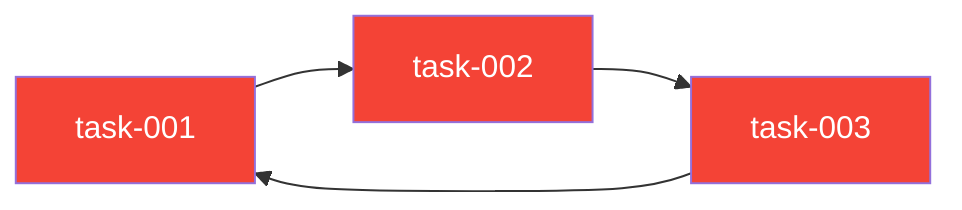

**Solución:** Asegúrate de que las dependencias formen un grafo acíclico (DAG).

### Worker colgado

Si un worker no responde:

1. Espera el timeout (default: 5 minutos)
2. O cancela manualmente con `c`
3. Verifica que el prompt no sea ambiguo

### Tokens agotados

Si alcanzas el límite de tokens:

1. El orchestrator pausa nuevas tareas
2. Puedes continuar después de que el presupuesto se recargue
3. O ajusta el `token_budget` en plan.md

---

## Soporte

- **Repositorio:** https://github.com/alejandrogarro-championsys/pi-orchestrator
- **Issues:** https://github.com/alejandrogarro-championsys/pi-orchestrator/issues
- **Documentación:** Ver SPEC.md en el repositorio

---

*Manual de Usuario v0.1.0 — Pi Orchestrator*
