# SPEC.md — Pi Orchestrator

**Versión:** 0.1.0-draft\
**Autor:** Pi Orchestrator Team\
**Fecha:** 2026-07-03\
**Estado:** Draft

---

## Índice

 1. [Visión General del Producto](#1-visi%C3%B3n-general-del-producto)
 2. [Glosario y Definiciones](#2-glosario-y-definiciones)
 3. [Arquitectura del Sistema](#3-arquitectura-del-sistema)
 4. [Componentes Principales](#4-componentes-principales)
 5. [Flujo de Delegación](#5-flujo-de-delegaci%C3%B3n)
 6. [Manejo de Estado y Persistencia](#6-manejo-de-estado-y-persistencia)
 7. [Concurrencia y Cola de Escritura Atómica](#7-concurrencia-y-cola-de-escritura-at%C3%B3mica)
 8. [Observabilidad e Interfaz TUI](#8-observabilidad-e-interfaz-tui)
 9. [Controles Dinámicos y Atajos de Teclado](#9-controles-din%C3%A1micos-y-atajos-de-teclado)
10. [Seguridad y Sandboxing](#10-seguridad-y-sandboxing)
11. [Prevención de Riesgos y Mitigaciones (Red Team Rules)](#11-prevenci%C3%B3n-de-riesgos-y-mitigaciones-red-team-rules)
12. [Flujo de Datos End-to-End](#12-flujo-de-datos-end-to-end)
13. [Modelos de LLM y Tiers de Complejidad](#13-modelos-de-llm-y-tiers-de-complejidad)
14. [Especificación de Protocolos](#14-especificaci%C3%B3n-de-protocolos)
15. [Fases de Implementación](#15-fases-de-implementaci%C3%B3n)
16. [Métricas y Observabilidad](#16-m%C3%A9tricas-y-observabilidad)
17. [Casos de Uso y Escenarios](#17-casos-de-uso-y-escenarios)
18. [Diagramas de Arquitectura Completa](#18-diagramas-de-arquitectura-completa)
19. [Backlog y Futuras Funcionalidades](#19-backlog-y-futuras-funcionalidades)
20. [Apéndices](#20-ap%C3%A9ndices)
21. [Invocación del Workflow](#21-invocaci%C3%B3n-del-workflow)
22. [Configuración de Modelos LLM](#22-configuraci%C3%B3n-de-modelos-llm)

---

## 1. Visión General del Producto

### 1.1. Problema que Resuelve

Pi Orchestrator aborda tres problemas fundamentales del desarrollo asistido por IA:

| Problema | Descripción | Impacto |
| --- | --- | --- |
| **Context Rot** | A medida que una sesión de agente crece, el contexto se degrada por ruido acumulado, reduciendo la calidad de las respuestas | Degradación progresiva de output quality |
| **Consumo Excesivo de Tokens** | Sesiones largas acumulan tokens innecesarios en el historial | Costo económico elevado y latencia |
| **Falta de Paralelismo Real** | Un agente único ejecuta tareas secuencialmente | Throughput subóptimo para specs complejos |

### 1.2. Solución Propuesta

**Pi Orchestrator** es un sistema de orquestación multi-agente diseñado como una **extensión y skill** para el entorno de Pi Agent. Su objetivo principal es resolver el Context Rot y el consumo excesivo de tokens mediante la **delegación de tareas atómicas a subagentes aislados**. Todo el sistema es **observable y controlable en tiempo real** a través de una Interfaz de Usuario de Terminal (TUI) altamente interactiva.

### 1.3. Principios de Diseño

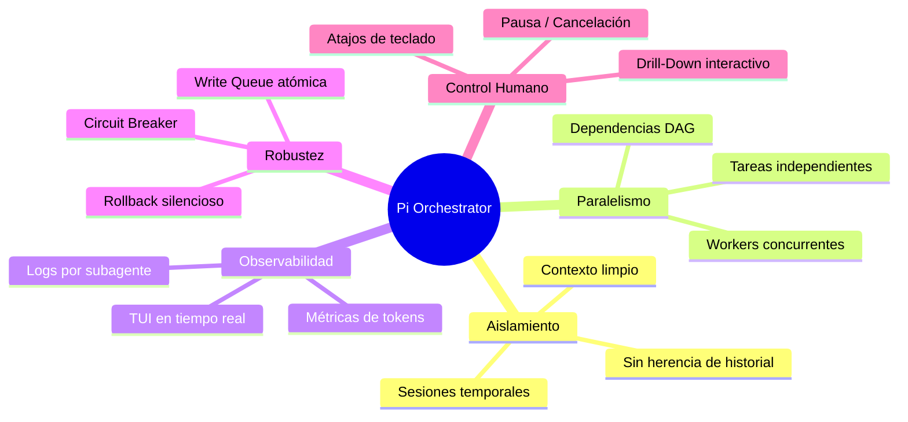
```mermaid
mindmap
  root((Pi Orchestrator))
    Aislamiento
      Sesiones temporales
      Contexto limpio
      Sin herencia de historial
    Paralelismo
      Tareas independientes
      Workers concurrentes
      Dependencias DAG
    Observabilidad
      TUI en tiempo real
      Métricas de tokens
      Logs por subagente
    Robustez
      Circuit Breaker
      Write Queue atómica
      Rollback silencioso
    Control Humano
      Atajos de teclado
      Pausa / Cancelación
      Drill-Down interactivo
```

### 1.4. Stack Tecnológico

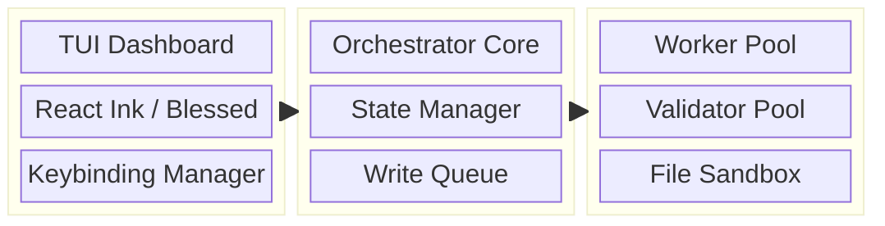
```mermaid
block-beta
  columns 3
  block:FRONTEND
    columns 1
    TUI["TUI Dashboard"]
    React["React Ink / Blessed"]
    Keys["Keybinding Manager"]
  end
  block:BACKEND
    columns 1
    Orch["Orchestrator Core"]
    StateMgr["State Manager"]
    WriteQueue["Write Queue"]
  end
  block:INFRA
    columns 1
    Workers["Worker Pool"]
    Validators["Validator Pool"]
    Sandbox["File Sandbox"]
  end

  FRONTEND --> BACKEND
  BACKEND --> INFRA
```

---

### 1.5. Invocación del Workflow

El sistema se invoca mediante el slash-command `/orchestrate` seguido de los archivos de entrada y opciones de configuración.

#### 1.5.1. Sintaxis del Comando

```text
/orchestrate <spec.md> <plan.md> [opciones]
```

**Parámetros obligatorios:**

| Parámetro | Tipo | Descripción |
| --- | --- | --- |
| `spec.md` | Archivo `.md` | Documento de especificación del negocio / requisitos |
| `plan.md` | Archivo `.md` | Plan de implementación con YAML frontmatter y tareas |

**Parámetros opcionales:**

| Opción | Alias | Descripción | Default |
| --- | --- | --- | --- |
| `--models <config>` | `-m` | Asignación de modelos por tier | Ver §22 |
| `--concurrency <n>` | `-c` | Máximo de workers concurrentes | `4` |
| `--timeout <ms>` | `-t` | Timeout global por tarea (ms) | `300000` |
| `--retries <n>` | `-r` | Máximo de reintentos por tarea | `3` |
| `--dry-run` | `-d` | Parsear y mostrar plan sin ejecutar | `false` |
| `--resume` |  | Reanudar plan existente desde `plan.md` | `false` |
| `--output <dir>` | `-o` | Directorio de salida | `./output/` |

#### 1.5.2. Ejemplos de Invocación

```bash
# Invocación básica
/orchestrate spec.md plan.md

# Con modelos personalizados
/orchestrate spec.md plan.md --models light=haiku,medium=sonnet,heavy=opus

# Máxima concurrencia con dry-run
/orchestrate spec.md plan.md --concurrency 8 --dry-run

# Reanudar plan existente
/orchestrate spec.md plan.md --resume

# Timeout extendido para tareas pesadas
/orchestrate spec.md plan.md --timeout 600000
```

#### 1.5.3. Flujo de Invocación

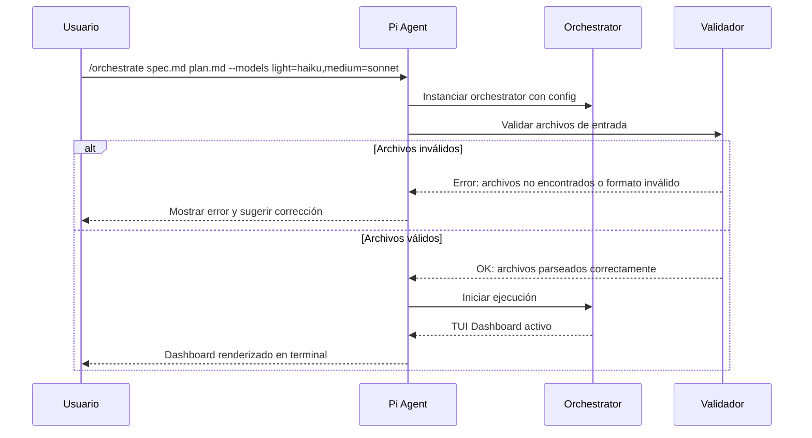
```mermaid
sequenceDiagram
    participant U as Usuario
    participant PI as Pi Agent
    participant ORCH as Orchestrator
    participant VAL as Validador

    U->>PI: /orchestrate spec.md plan.md --models light=haiku,medium=sonnet
    PI->>ORCH: Instanciar orchestrator con config
    PI->>VAL: Validar archivos de entrada
    
    alt Archivos inválidos
        VAL-->>PI: Error: archivos no encontrados o formato inválido
        PI-->>U: Mostrar error y sugerir corrección
    else Archivos válidos
        VAL-->>PI: OK: archivos parseados correctamente
        PI->>ORCH: Iniciar ejecución
        ORCH-->>PI: TUI Dashboard activo
        PI-->>U: Dashboard renderizado en terminal
    end
```

#### 1.5.4. Validación Pre-Ejecución

Antes de iniciar, el sistema valida:

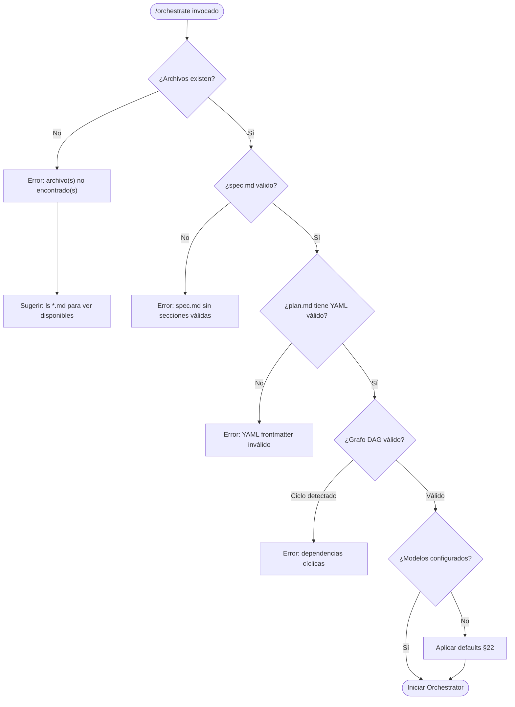
```mermaid
flowchart TD
    START([/orchestrate invocado]) --> CHECK_FILES{¿Archivos existen?}
    
    CHECK_FILES -->|No| ERR_FILES["Error: archivo(s) no encontrado(s)"]
    ERR_FILES --> SUGGEST["Sugerir: ls *.md para ver disponibles"]
    
    CHECK_FILES -->|Sí| CHECK_SPEC{¿spec.md válido?}
    
    CHECK_SPEC -->|No| ERR_SPEC["Error: spec.md sin secciones válidas"]
    
    CHECK_SPEC -->|Sí| CHECK_PLAN{¿plan.md tiene YAML válido?}
    
    CHECK_PLAN -->|No| ERR_PLAN["Error: YAML frontmatter inválido"]
    
    CHECK_PLAN -->|Sí| CHECK_DEPS{¿Grafo DAG válido?}
    
    CHECK_DEPS -->|Ciclo detectado| ERR_DEPS["Error: dependencias cíclicas"]
    
    CHECK_DEPS -->|Válido| CHECK_MODELS{¿Modelos configurados?}
    
    CHECK_MODELS -->|No| APPLY_DEFAULTS["Aplicar defaults §22"]
    CHECK_MODELS -->|Sí| START_ORCH([Iniciar Orchestrator])
    APPLY_DEFAULTS --> START_ORCH
```

#### 1.5.5. Formato del plan.md Requerido

El archivo `plan.md` DEBE contener un bloque YAML válido en la cabecera:

```yaml
---
version: "1.0"
plan_id: "plan-2026-07-03-auth"
created_at: "2026-07-03T10:30:00Z"
status: "queued"

# Configuración de modelos (opcional — ver §22)
models:
  light: "haiku"
  medium: "sonnet"
  heavy: "opus"

# Opciones de ejecución
config:
  max_concurrent_workers: 4
  max_retries: 3
  timeout_per_task_ms: 300000

# Tareas
tasks:
  - id: "task-001"
    title: "Definir schema"
    tier: "light"
    dependencies: []
    # ...
---

# Descripción del Negocio

[Contenido Markdown aquí...]
```

#### 1.5.6. Errores Comunes y Soluciones

| Error | Causa | Solución |
| --- | --- | --- |
| `ENOENT: spec.md` | Archivo no encontrado | Verificar ruta, usar `ls` para confirmar |
| `YAML_PARSE_ERROR` | Frontmatter malformado | Revisar indentación y sintaxis YAML |
| `CYCLIC_DEPENDENCIES` | Tareas dependen circularmente | Revisar `dependencies` en cada tarea |
| `NO_TASKS_DEFINED` | plan.md sin bloque `tasks:` | Agregar al menos una tarea en el YAML |
| `INVALID_TIER` | Tier no reconocido | Usar solo: `light`, `medium`, `heavy` |
| `MODEL_NOT_AVAILABLE` | Modelo no disponible en Pi | Verificar `pi models` para opciones |

---

### 1.6. Configuración de Modelos LLM

La configuración de modelos se define en **tres niveles de prioridad**, de mayor a menor:

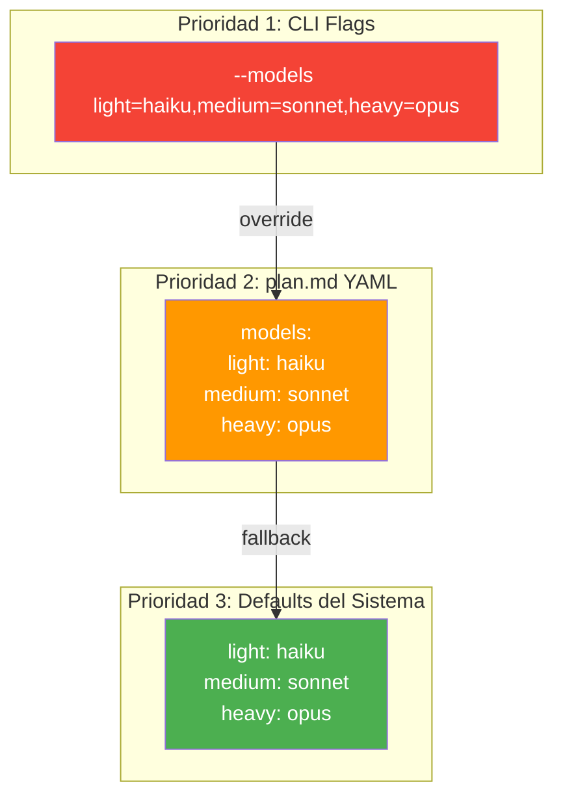
```mermaid
graph TB
    subgraph "Prioridad 1: CLI Flags"
        CLI["--models light=haiku,medium=sonnet,heavy=opus"]
    end

    subgraph "Prioridad 2: plan.md YAML"
        YAML["models:\n  light: haiku\n  medium: sonnet\n  heavy: opus"]
    end

    subgraph "Prioridad 3: Defaults del Sistema"
        DEFAULTS["light: haiku\nmedium: sonnet\nheavy: opus"]
    end

    CLI -->|"override"| YAML
    YAML -->|"fallback"| DEFAULTS

    style CLI fill:#f44336,color:#fff
    style YAML fill:#FF9800,color:#fff
    style DEFAULTS fill:#4CAF50,color:#fff
```

#### 1.6.1. Opciones de Modelos Disponibles

Los tiers y sus modelos asociados se pueden configurar de múltiples formas:

| Tier | Descripción | Modelos Válidos | Default |
| --- | --- | --- | --- |
| `light` | Tareas simples, CRUD, config | `haiku`, `sonnet` | `haiku` |
| `medium` | Lógica de negocio, APIs, tests | `sonnet`, `opus` | `sonnet` |
| `heavy` | Arquitectura, algoritmos, seguridad | `opus` | `opus` |

#### 1.6.2. Sintaxis de Configuración por CLI

```bash
# Formato completo
--models light=haiku,medium=sonnet,heavy=opus

# Solo sobreescribir un tier
--models medium=opus

# Múltiples opciones (el sistema elige la más barata)
--models light=haiku,medium=sonnet
```

#### 1.6.3. Sintaxis de Configuración en plan.md

```yaml
---
models:
  # Formato 1: Asignación directa
  light: haiku
  medium: sonnet
  heavy: opus

  # Formato 2: Con presupuesto por tier (futuro)
  # light:
  #   model: haiku
  #   max_tokens: 50000
  # medium:
  #   model: sonnet
  #   max_tokens: 200000
  # heavy:
  #   model: opus
  #   max_tokens: 100000
---
```

#### 1.6.4. Flujo de Resolución de Modelos

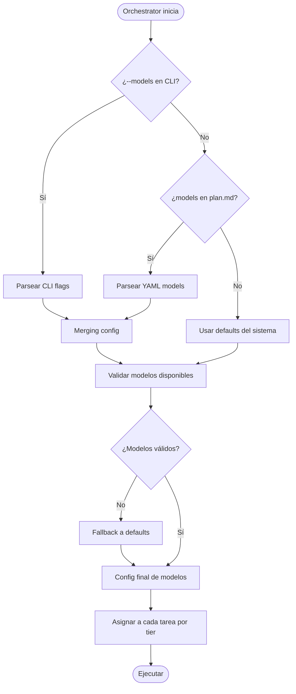
```mermaid
flowchart TD
    START([Orchestrator inicia]) --> READ_CLI{¿--models en CLI?}
    
    READ_CLI -->|Sí| PARSE_CLI["Parsear CLI flags"]
    PARSE_CLI --> MERGE["Merging config"]
    
    READ_CLI -->|No| READ_YAML{¿models en plan.md?}
    
    READ_YAML -->|Sí| PARSE_YAML["Parsear YAML models"]
    PARSE_YAML --> MERGE
    
    READ_YAML -->|No| USE_DEFAULTS["Usar defaults del sistema"]
    USE_DEFAULTS --> VALIDATE
    
    MERGE --> VALIDATE["Validar modelos disponibles"]
    
    VALIDATE --> CHECK_AVAIL{¿Modelos válidos?}
    
    CHECK_AVAIL -->|No| FALLBACK["Fallback a defaults"]
    FALLBACK --> FINAL
    
    CHECK_AVAIL -->|Sí| FINAL["Config final de modelos"]
    
    FINAL --> ASSIGN["Asignar a cada tarea por tier"]
    ASSIGN --> ORCH_START([Ejecutar])
```

#### 1.6.5. Asignación Automática de Tiers

Cuando el usuario no especifica el tier manualmente en cada tarea, el Orchestrator lo asigna automáticamente:

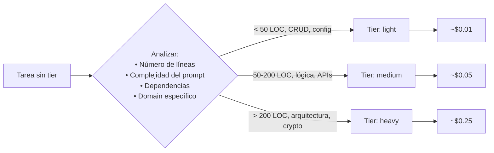
```mermaid
flowchart LR
    TASK["Tarea sin tier"] --> ANALYZE{"Analizar:\n• Número de líneas\n• Complejidad del prompt\n• Dependencias\n• Domain específico"}
    
    ANALYZE -->|"< 50 LOC, CRUD, config"| LIGHT["Tier: light"]
    ANALYZE -->|"50-200 LOC, lógica, APIs"| MEDIUM["Tier: medium"]
    ANALYZE -->|"> 200 LOC, arquitectura, crypto"| HEAVY["Tier: heavy"]
    
    LIGHT --> COST_LIGHT["~$0.01"]
    MEDIUM --> COST_MED["~$0.05"]
    HEAVY --> COST_HEAVY["~$0.25"]
```

#### 1.6.6. Override de Tier por Tarea

El usuario puede forzar un tier específico en el plan.md:

```yaml
tasks:
  - id: "task-001"
    title: "Config simple"
    tier: "light"           # Forzado: siempre haiku
    model: "haiku"          # Override explícito del modelo
    dependencies: []

  - id: "task-002"
    title: "Arquitectura crítica"
    tier: "heavy"           # Forzado: siempre opus
    model: "opus"           # Override explícito
    dependencies: ["task-001"]

  - id: "task-003"
    title: "Implementación estándar"
    # tier y model omitidos → auto-asignación
    dependencies: ["task-001"]
```

#### 1.6.7. Interacción con el Usuario durante Ejecución

El sistema puede solicitar confirmación al usuario en ciertos escenarios:

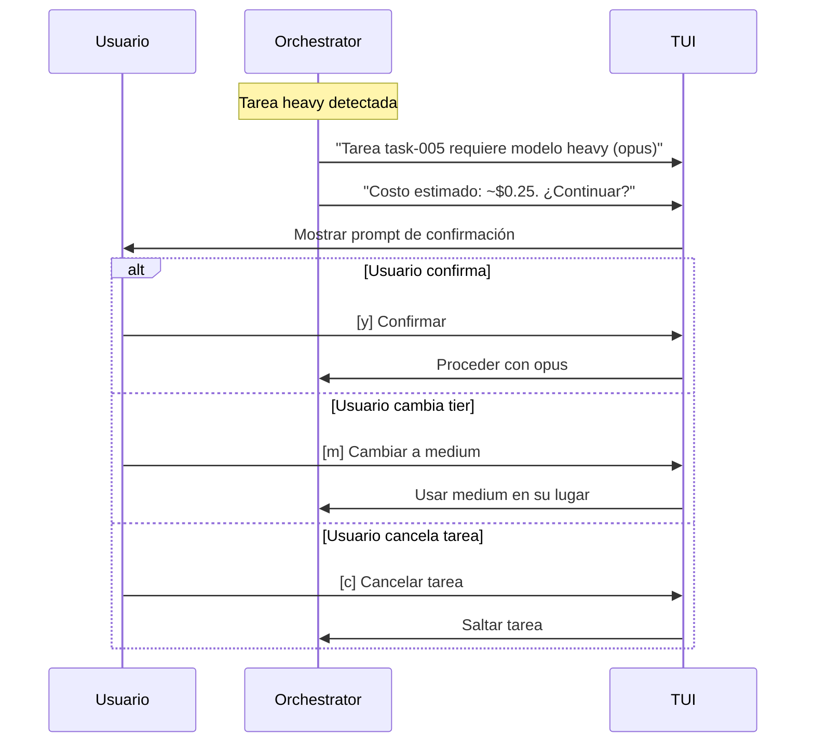
```mermaid
sequenceDiagram
    participant U as Usuario
    participant ORCH as Orchestrator
    participant TUI as TUI

    Note over ORCH: Tarea heavy detectada
    ORCH->>TUI: "Tarea task-005 requiere modelo heavy (opus)" 
    ORCH->>TUI: "Costo estimado: ~$0.25. ¿Continuar?"
    TUI->>U: Mostrar prompt de confirmación
    
    alt Usuario confirma
        U->>TUI: [y] Confirmar
        TUI->>ORCH: Proceder con opus
    else Usuario cambia tier
        U->>TUI: [m] Cambiar a medium
        TUI->>ORCH: Usar medium en su lugar
    else Usuario cancela tarea
        U->>TUI: [c] Cancelar tarea
        TUI->>ORCH: Saltar tarea
    end
```

#### 1.6.8. Presupuesto de Tokens por Tier

Opcionalmente, se puede definir un presupuesto por tier para controlar costos:

```yaml
---
models:
  light: haiku
  medium: sonnet
  heavy: opus

token_budget:
  total_limit: 500000
  by_tier:
    light:
      limit: 100000
      warning_threshold: 80000
    medium:
      limit: 300000
      warning_threshold: 240000
    heavy:
      limit: 100000
      warning_threshold: 80000
---
```

#### 1.6.9. Tabla Resumen de Configuración

| Nivel | Ubicación | Prioridad | Uso Recomendado |
| --- | --- | --- | --- |
| CLI Flags | `--models` | **Alta** (override) | Para pruebas rápidas o ajustes temporales |
| plan.md YAML | `models:` section | **Media** (config) | Para configuración por proyecto |
| Defaults | Sistema | **Baja** (fallback) | Cuando no se especifica nada |
| Task Override | `model:` en tarea | **Máxima** (forzado) | Para tareas críticas específicas |

#### 1.6.10. Diagrama Completo de Decisión

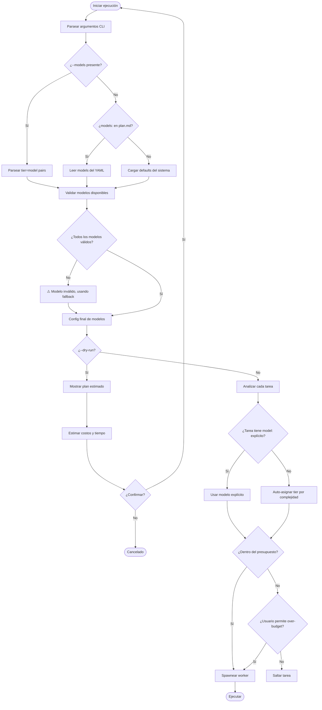
```mermaid
flowchart TB
    START(["/orchestrate spec.md plan.md"]) --> PARSE["Parsear argumentos CLI"]
    
    PARSE --> CLI_FLAG{¿--models presente?}
    CLI_FLAG -->|Sí| PARSE_CLI["Parsear tier=model pairs"]
    CLI_FLAG -->|No| YAML_CHECK{¿models: en plan.md?}
    
    PARSE_CLI --> VALIDATE_MODELS["Validar modelos disponibles"]
    YAML_CHECK -->|Sí| PARSE_YAML["Leer models del YAML"]
    YAML_CHECK -->|No| DEFAULTS["Cargar defaults del sistema"]
    
    PARSE_YAML --> VALIDATE_MODELS
    DEFAULTS --> VALIDATE_MODELS
    
    VALIDATE_MODELS --> MODELS_OK{¿Todos los modelos válidos?}
    MODELS_OK -->|No| FALLBACK_WARN["⚠️ Modelo inválido, usando fallback"]
    FALLBACK_WARN --> FINAL_CONFIG
    MODELS_OK -->|Sí| FINAL_CONFIG["Config final de modelos"]
    
    FINAL_CONFIG --> DRY_RUN{¿--dry-run?}
    DRY_RUN -->|Sí| SHOW_PLAN["Mostrar plan estimado"]
    SHOW_PLAN --> ESTIMATE["Estimar costos y tiempo"]
    ESTIMATE --> CONFIRM{¿Confirmar?}
    CONFIRM -->|Sí| START([Iniciar ejecución])
    CONFIRM -->|No| CANCEL([Cancelado])
    
    DRY_RUN -->|No| TASK_ANALYSIS["Analizar cada tarea"]
    TASK_ANALYSIS --> PER_TASK{¿Tarea tiene model: explícito?}
    PER_TASK -->|Sí| USE_EXPLICIT["Usar modelo explícito"]
    PER_TASK -->|No| AUTO_TIER["Auto-asignar tier por complejidad"]
    
    USE_EXPLICIT --> CHECK_BUDGET{¿Dentro del presupuesto?}
    AUTO_TIER --> CHECK_BUDGET
    
    CHECK_BUDGET -->|Sí| SPAWN["Spawnear worker"]
    CHECK_BUDGET -->|No| OVER_BUDGET{"¿Usuario permite over-budget?"}
    OVER_BUDGET -->|Sí| SPAWN
    OVER_BUDGET -->|No| SKIP["Saltar tarea"]
    
    SPAWN --> EXECUTE([Ejecutar])
```

---

## 2. Glosario y Definiciones

| Término | Definición |
| --- | --- |
| **Orquestador** | Agente principal que coordina la ejecución del plan |
| **Worker** | Subagente temporal que ejecuta una tarea atómica |
| **Validator** | Subagente ligero que verifica el output de un Worker |
| **plan.md** | Archivo de verdad fuente con YAML frontmatter + Markdown |
| **TUI** | Terminal User Interface — dashboard interactivo |
| **Context Rot** | Degradación del contexto del agente por acumulación de ruido |
| **DAG** | Directed Acyclic Graph — grafo de dependencias de tareas |
| **Circuit Breaker** | Patrón de diseño que interrumpe ejecuciones en bucle |
| **Tier** | Nivel de complejidad asignado a un modelo (light/medium/heavy) |
| **Trash** | Directorio `./output/.trash/` donde van archivos de tareas canceladas |
| **Write Queue** | Cola FIFO de escrituras atómicas al plan.md |

---

## 3. Arquitectura del Sistema

### 3.1. Diagrama de Componentes de Alto Nivel

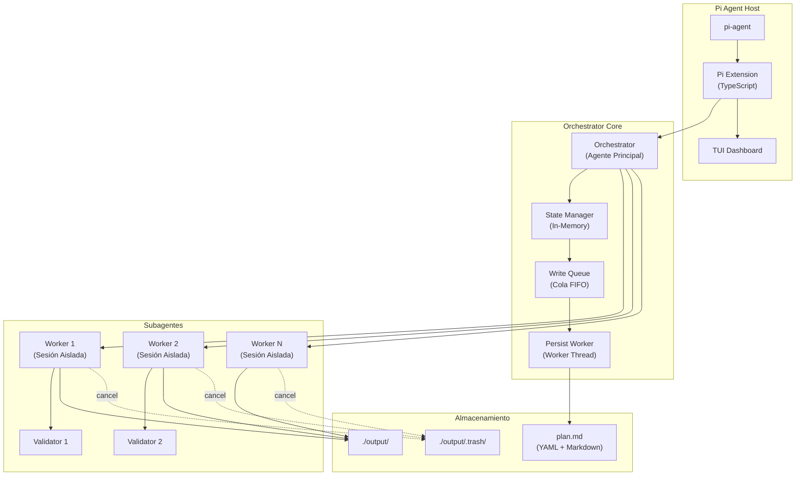
```mermaid
graph TB
    subgraph "Pi Agent Host"
        PI["pi-agent"]
        EXTENSION["Pi Extension<br/>(TypeScript)"]
        TUI_DASH["TUI Dashboard"]
    end

    subgraph "Orchestrator Core"
        ORCH["Orchestrator<br/>(Agente Principal)"]
        STATE_MGR["State Manager<br/>(In-Memory)"]
        WRITE_QUEUE["Write Queue<br/>(Cola FIFO)"]
        PERSIST["Persist Worker<br/>(Worker Thread)"]
    end

    subgraph "Subagentes"
        W1["Worker 1<br/>(Sesión Aislada)"]
        W2["Worker 2<br/>(Sesión Aislada)"]
        W3["Worker N<br/>(Sesión Aislada)"]
        V1["Validator 1"]
        V2["Validator 2"]
    end

    subgraph "Almacenamiento"
        PLAN["plan.md<br/>(YAML + Markdown)"]
        OUTPUT["./output/"]
        TRASH["./output/.trash/"]
    end

    PI --> EXTENSION
    EXTENSION --> ORCH
    EXTENSION --> TUI_DASH
    ORCH --> STATE_MGR
    ORCH --> W1 & W2 & W3
    W1 --> V1
    W2 --> V2
    STATE_MGR --> WRITE_QUEUE
    WRITE_QUEUE --> PERSIST
    PERSIST --> PLAN
    W1 & W2 & W3 --> OUTPUT
    W1 & W2 & W3 -.->|cancel| TRASH
```

### 3.2. Diagrama de Despliegue

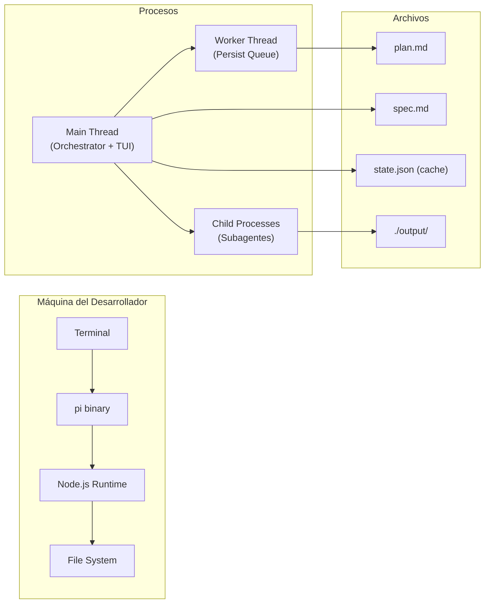
```mermaid
graph LR
    subgraph "Máquina del Desarrollador"
        TERM["Terminal"]
        PI_BIN["pi binary"]
        NODE["Node.js Runtime"]
        FS["File System"]

        TERM --> PI_BIN
        PI_BIN --> NODE
        NODE --> FS
    end

    subgraph "Procesos"
        MAIN["Main Thread<br/>(Orchestrator + TUI)"]
        WORKER_THREAD["Worker Thread<br/>(Persist Queue)"]
        SPAWN["Child Processes<br/>(Subagentes)"]

        MAIN --> WORKER_THREAD
        MAIN --> SPAWN
    end

    subgraph "Archivos"
        PLAN_MD["plan.md"]
        SPEC_MD["spec.md"]
        STATE_JSON["state.json (cache)"]
        OUTPUT_DIR["./output/"]

        WORKER_THREAD --> PLAN_MD
        MAIN --> SPEC_MD
        MAIN --> STATE_JSON
        SPAWN --> OUTPUT_DIR
    end
```

### 3.3. Capas de la Arquitectura

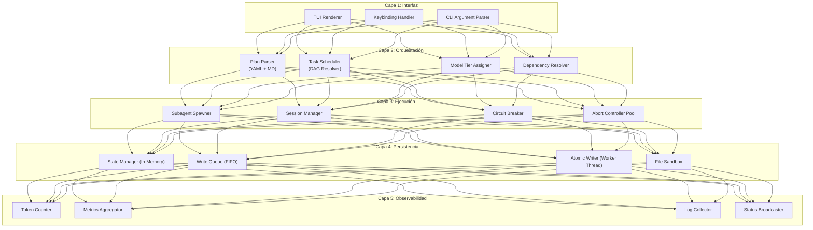
```mermaid
graph TB
    subgraph "Capa 1: Interfaz"
        A1["TUI Renderer"]
        A2["Keybinding Handler"]
        A3["CLI Argument Parser"]
    end

    subgraph "Capa 2: Orquestación"
        B1["Plan Parser<br/>(YAML + MD)"]
        B2["Task Scheduler<br/>(DAG Resolver)"]
        B3["Model Tier Assigner"]
        B4["Dependency Resolver"]
    end

    subgraph "Capa 3: Ejecución"
        C1["Subagent Spawner"]
        C2["Session Manager"]
        C3["Circuit Breaker"]
        C4["Abort Controller Pool"]
    end

    subgraph "Capa 4: Persistencia"
        D1["State Manager (In-Memory)"]
        D2["Write Queue (FIFO)"]
        D3["Atomic Writer (Worker Thread)"]
        D4["File Sandbox"]
    end

    subgraph "Capa 5: Observabilidad"
        E1["Token Counter"]
        E2["Metrics Aggregator"]
        E3["Log Collector"]
        E4["Status Broadcaster"]
    end

    A1 & A2 & A3 --> B1 & B2 & B3 & B4
    B1 & B2 & B3 & B4 --> C1 & C2 & C3 & C4
    C1 & C2 & C3 & C4 --> D1 & D2 & D3 & D4
    D1 & D2 & D3 & D4 --> E1 & E2 & E3 & E4
```

---

## 4. Componentes Principales

### 4.1. Orquestador (Agente Principal)

El Orquestador es el cerebro del sistema. Toma un `plan.md` cerrado, evalúa las tareas, asigna modelos de LLM basados en la complejidad (light, medium, heavy) y coordina las dependencias.

#### 4.1.1. Responsabilidades

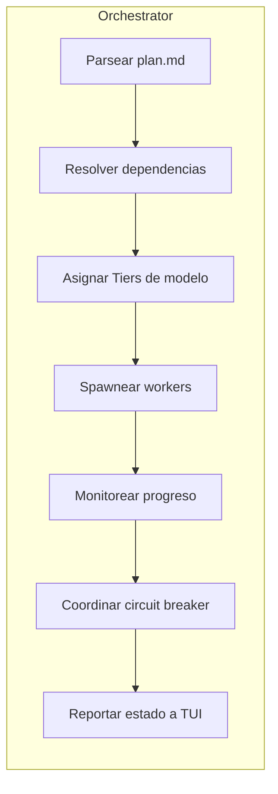
```mermaid
graph LR
    subgraph "Orchestrator"
        direction TB
        P["Parsear plan.md"]
        D["Resolver dependencias"]
        T["Asignar Tiers de modelo"]
        S["Spawnear workers"]
        M["Monitorear progreso"]
        C["Coordinar circuit breaker"]
        R["Reportar estado a TUI"]
    end

    P --> D --> T --> S --> M --> C --> R
```

#### 4.1.2. Prompt del Orquestador

```text
## System Prompt: Orchestrator

Eres el orquestador de Pi Orchestrator. Tu trabajo es:

1. Leer el plan.md completo
2. Extraer el bloque YAML frontmatter
3. Analizar el grafo de dependencias (DAG)
4. Para cada tarea, determinar el Tier de complejidad (light/medium/heavy)
5. Asignar el modelo LLM apropiado
6. Spawnear workers para tareas sin dependencias pendientes
7. Recibir resultados y actualizar el estado
8. Alertar al usuario via TUI si hay bloqueos

REGLAS ESTRICTAS:
- NUNCA ejecutes código directamente. Delega TODO a workers.
- Mantén tu output mínimo: solo JSON de estado.
- Si un worker falla 3 veces, marca la tarea como "blocked".
- Reporta cada cambio de estado al State Manager.
```

#### 4.1.3. Ciclo de Vida del Orquestador

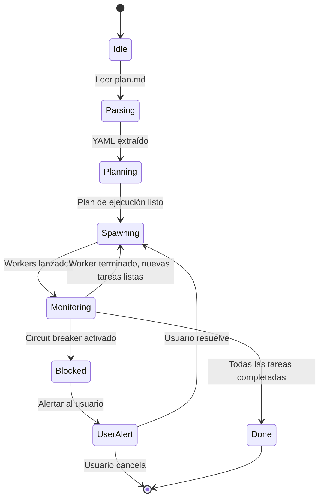
```mermaid
stateDiagram-v2
    [*] --> Idle
    Idle --> Parsing: Leer plan.md
    Parsing --> Planning: YAML extraído
    Planning --> Spawning: Plan de ejecución listo
    Spawning --> Monitoring: Workers lanzados
    Monitoring --> Spawning: Worker terminado, nuevas tareas listas
    Monitoring --> Blocked: Circuit breaker activado
    Blocked --> UserAlert: Alertar al usuario
    UserAlert --> Spawning: Usuario resuelve
    UserAlert --> [*]: Usuario cancela
    Monitoring --> Done: Todas las tareas completadas
    Done --> [*]
```

### 4.2. Workers (Subagentes Ejecutores)

Sesiones aisladas (AgentSessions) instanciadas temporalmente. Reciben un System Prompt mínimo y tienen acceso a herramientas CLI (bash, read, write).

#### 4.2.1. Características del Worker

| Propiedad | Valor |
| --- | --- |
| **Vida útil** | Temporal — se destruye al completar la tarea |
| **Contexto** | Limpio — sin historial previo |
| **Herramientas** | `bash`, `read`, `write`, `edit` (sin `spawn_subagent`) |
| **Sandbox** | `./output/{task_id}/` |
| **Timeout** | Configurable por tarea (default: 300s) |
| **Modelo** | Asignado por Tier (light/medium/heavy) |

#### 4.2.2. Prompt del Worker

```text
## System Prompt: Worker

Eres un worker de Pi Orchestrator. Tu trabajo es:

1. Recibir una tarea específica en JSON
2. Ejecutar la tarea usando las herramientas disponibles
3. Generar el output especificado en el contrato de la tarea
4. Devolver un resultado en formato JSON con status: "done" | "fail"

REGLAS ESTRICTAS:
- NO modifiques archivos fuera de tu sandbox
- NO ejecuten comandos destructivos sin confirmación
- Tu output debe ser EXACTAMENTE el formato JSON especificado
- Si la tarea requiere más de 3 intentos, falla con error descriptivo
- NUNCA uses spawn_subagent — no tienes acceso
```

#### 4.2.3. Formato de Output del Worker

```json
{
  "task_id": "task-001",
  "status": "done | fail",
  "output": {
    "files_created": ["src/auth/login.ts", "src/auth/types.ts"],
    "summary": "Implementado el módulo de login con OAuth2",
    "tokens_used": 2340,
    "duration_ms": 15200
  },
  "error": null
}
```

#### 4.2.4. Ciclo de Vida del Worker

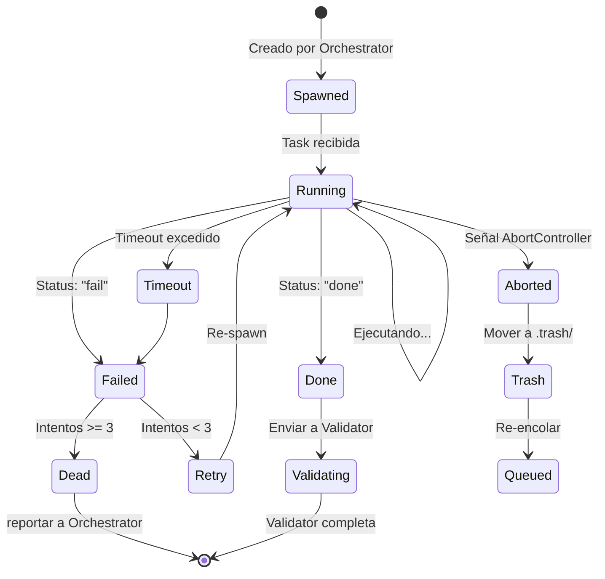
```mermaid
stateDiagram-v2
    [*] --> Spawned: Creado por Orchestrator
    Spawned --> Running: Task recibida
    Running --> Running: Ejecutando...
    Running --> Done: Status: "done"
    Running --> Failed: Status: "fail"
    Running --> Timeout: Timeout excedido
    Running --> Aborted: Señal AbortController
    Done --> Validating: Enviar a Validator
    Failed --> Retry: Intentos < 3
    Failed --> Dead: Intentos >= 3
    Retry --> Running: Re-spawn
    Dead --> [*]: reportar a Orchestrator
    Validating --> [*]: Validator completa
    Aborted --> Trash: Mover a .trash/
    Trash --> Queued: Re-encolar
    Timeout --> Failed
```

### 4.3. Validators (Subagentes de QA)

Sesiones aisladas ligeras que verifican los *output contracts* de los Workers sin modificar el código.

#### 4.3.1. Responsabilidades del Validator

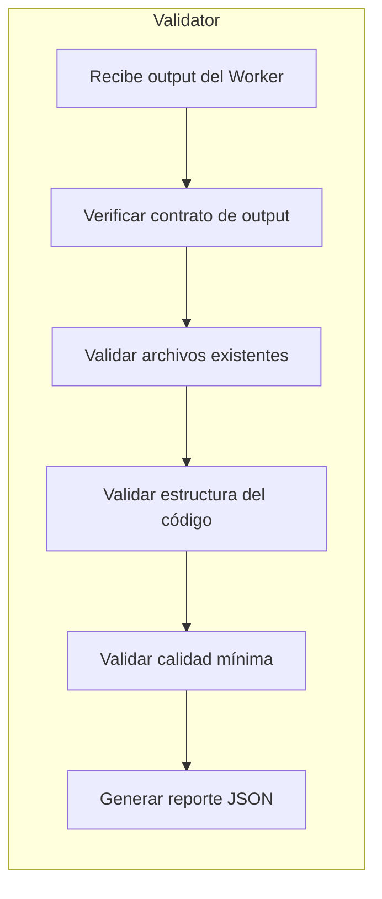
```mermaid
graph TB
    subgraph "Validator"
        direction TB
        INPUT["Recibe output del Worker"]
        CONTRACT["Verificar contrato de output"]
        FILES["Validar archivos existentes"]
        STRUCT["Validar estructura del código"]
        QUALITY["Validar calidad mínima"]
        OUTPUT["Generar reporte JSON"]
    end

    INPUT --> CONTRACT --> FILES --> STRUCT --> QUALITY --> OUTPUT
```

#### 4.3.2. Prompt del Validator

```text
## System Prompt: Validator

Eres un validador de Pi Orchestrator. Tu trabajo es:

1. Recibir el output de un worker
2. Verificar que el contrato de output se cumple
3. Validar que los archivos existen y tienen la estructura correcta
4. Reportar el resultado en formato JSON

REGLAS ESTRICTAS:
- NO modifiques NINGÚN archivo
- NO ejecutes código que no sea de validación
- Tu output debe ser EXACTAMENTE: { "valid": true/false, "issues": [...] }
- Sé conciso — solo reporta problemas encontrados
```

#### 4.3.3. Formato de Output del Validator

```json
{
  "task_id": "task-001",
  "valid": true,
  "issues": [],
  "checks_performed": [
    {"check": "files_exist", "passed": true},
    {"check": "syntax_valid", "passed": true},
    {"check": "output_format", "passed": true}
  ],
  "tokens_used": 340
}
```

---

## 5. Flujo de Delegación

### 5.1. Flujo Principal End-to-End

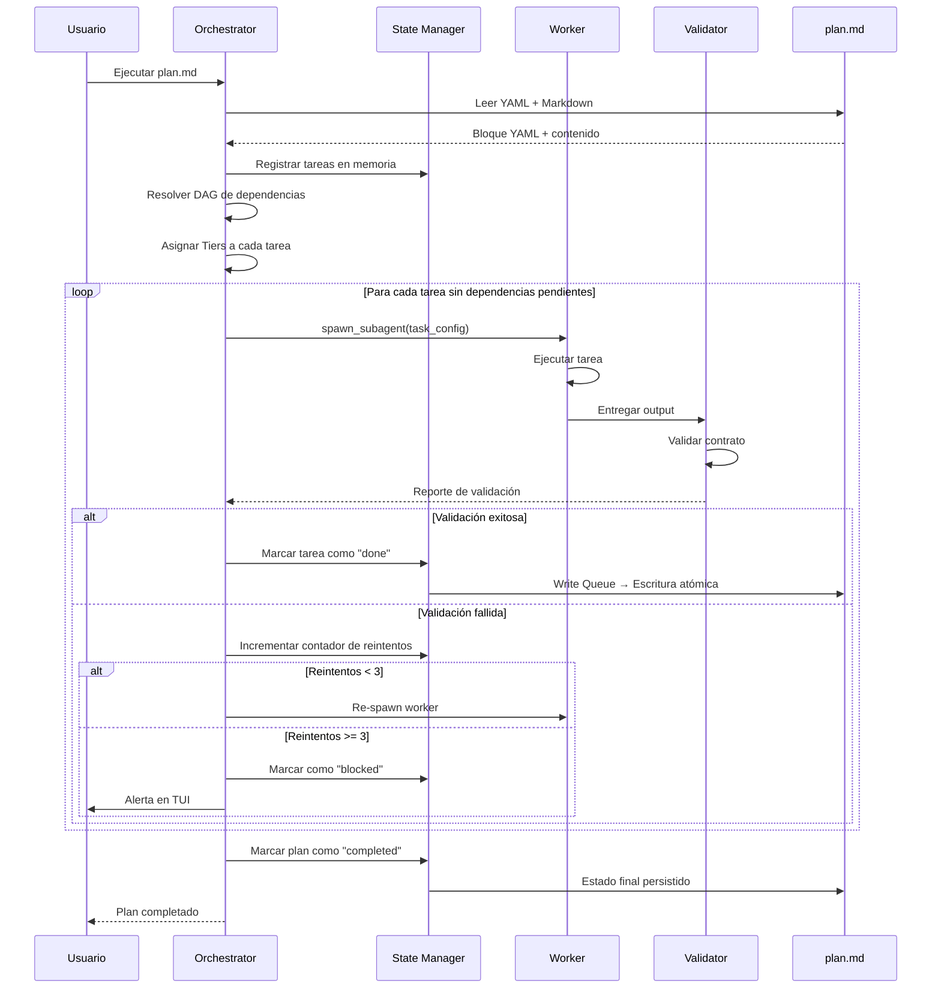
```mermaid
sequenceDiagram
    participant U as Usuario
    participant O as Orchestrator
    participant S as State Manager
    participant W as Worker
    participant V as Validator
    participant P as plan.md

    U->>O: Ejecutar plan.md
    O->>P: Leer YAML + Markdown
    P-->>O: Bloque YAML + contenido
    O->>S: Registrar tareas en memoria
    O->>O: Resolver DAG de dependencias
    O->>O: Asignar Tiers a cada tarea

    loop Para cada tarea sin dependencias pendientes
        O->>W: spawn_subagent(task_config)
        W->>W: Ejecutar tarea
        W->>V: Entregar output
        V->>V: Validar contrato
        V-->>O: Reporte de validación

        alt Validación exitosa
            O->>S: Marcar tarea como "done"
            S->>P: Write Queue → Escritura atómica
        else Validación fallida
            O->>S: Incrementar contador de reintentos
            alt Reintentos < 3
                O->>W: Re-spawn worker
            else Reintentos >= 3
                O->>S: Marcar como "blocked"
                O->>U: Alerta en TUI
            end
        end
    end

    O->>S: Marcar plan como "completed"
    S->>P: Estado final persistido
    O-->>U: Plan completado
```

### 5.2. Diagrama de Flujo de Decisión del Orchestrator

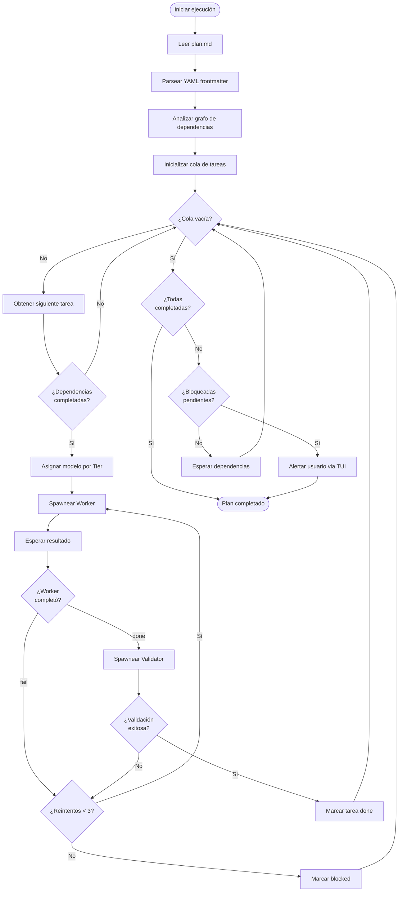
```mermaid
flowchart TD
    START([Iniciar ejecución]) --> READ["Leer plan.md"]
    READ --> PARSE["Parsear YAML frontmatter"]
    PARSE --> ANALYZE["Analizar grafo de dependencias"]

    ANALYZE --> QUEUE_INIT["Inicializar cola de tareas"]
    QUEUE_INIT --> CHECK_EMPTY{¿Cola vacía?}

    CHECK_EMPTY -->|No| GET_NEXT["Obtener siguiente tarea"]
    GET_NEXT --> CHECK_DEPS{¿Dependencias<br/>completadas?}

    CHECK_DEPS -->|No| CHECK_EMPTY
    CHECK_DEPS -->|Sí| ASSIGN_MODEL["Asignar modelo por Tier"]
    ASSIGN_MODEL --> SPAWN["Spawnear Worker"]
    SPAWN --> WAIT["Esperar resultado"]

    WAIT --> RESULT{¿Worker<br/>completó?}
    RESULT -->|done| VALIDATE["Spawnear Validator"]
    RESULT -->|fail| RETRY_CHECK{¿Reintentos < 3?}

    RETRY_CHECK -->|Sí| SPAWN
    RETRY_CHECK -->|No| BLOCKED["Marcar blocked"]

    VALIDATE --> VAL_RESULT{¿Validación<br/>exitosa?}
    VAL_RESULT -->|Sí| MARK_DONE["Marcar tarea done"]
    VAL_RESULT -->|No| RETRY_CHECK

    MARK_DONE --> CHECK_EMPTY
    BLOCKED --> CHECK_EMPTY

    CHECK_EMPTY -->|Sí| ALL_DONE{¿Todas<br/>completadas?}
    ALL_DONE -->|Sí| FINISH([Plan completado])
    ALL_DONE -->|No| CHECK_BLOCKED{¿Bloqueadas<br/>pendientes?}
    CHECK_BLOCKED -->|Sí| ALERT["Alertar usuario via TUI"]
    CHECK_BLOCKED -->|No| WAIT_DEPS["Esperar dependencias"]
    ALERT --> FINISH
    WAIT_DEPS --> CHECK_EMPTY
```

### 5.3. Flujo de Dependencias (DAG)

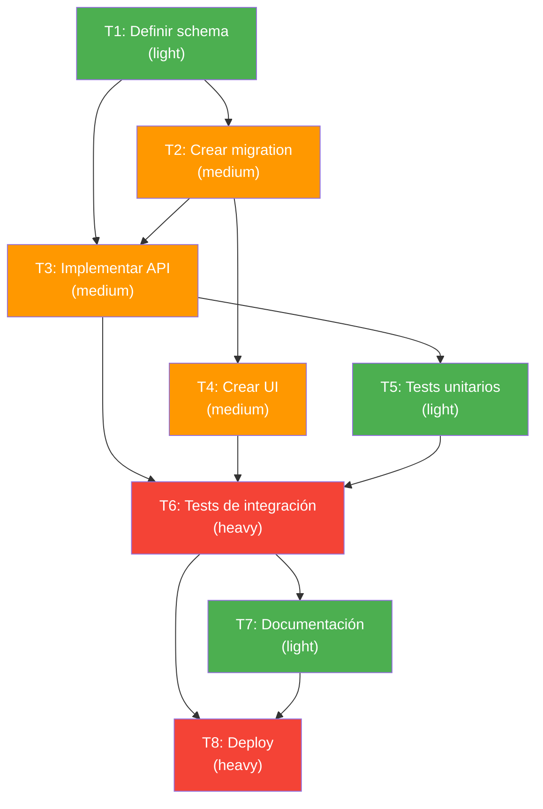
```mermaid
graph TD
    T1["T1: Definir schema<br/>(light)"]
    T2["T2: Crear migration<br/>(medium)"]
    T3["T3: Implementar API<br/>(medium)"]
    T4["T4: Crear UI<br/>(medium)"]
    T5["T5: Tests unitarios<br/>(light)"]
    T6["T6: Tests de integración<br/>(heavy)"]
    T7["T7: Documentación<br/>(light)"]
    T8["T8: Deploy<br/>(heavy)"]

    T1 --> T2
    T1 --> T3
    T2 --> T3
    T2 --> T4
    T3 --> T5
    T3 --> T6
    T4 --> T6
    T5 --> T6
    T6 --> T7
    T6 --> T8
    T7 --> T8

    style T1 fill:#4CAF50,color:#fff
    style T2 fill:#FF9800,color:#fff
    style T3 fill:#FF9800,color:#fff
    style T4 fill:#FF9800,color:#fff
    style T5 fill:#4CAF50,color:#fff
    style T6 fill:#f44336,color:#fff
    style T7 fill:#4CAF50,color:#fff
    style T8 fill:#f44336,color:#fff
```

**Leyenda de colores:** 🟢 Light (haiku) | 🟠 Medium (sonnet) | 🔴 Heavy (opus)

---

## 6. Manejo de Estado y Persistencia

### 6.1. Estructura del plan.md

El archivo `plan.md` es la fuente de verdad y el estado persistente del sistema.

```yaml
# plan.md — Ejemplo de Estructura

---
# YAML Frontmatter (Estado de la Máquina de Estados)
version: "1.0"
plan_id: "plan-2026-07-03-auth-module"
created_at: "2026-07-03T10:30:00Z"
updated_at: "2026-07-03T11:15:00Z"
status: "in_progress"  # queued | in_progress | blocked | completed | failed

# Configuración Global
config:
  max_concurrent_workers: 4
  max_retries: 3
  timeout_per_task_ms: 300000
  trash_on_cancel: true

# Token Budget (ventana deslizante)
token_budget:
  total_limit: 500000
  current_usage: 125000
  window_minutes: 60

# Métricas Agregadas
metrics:
  total_tasks: 8
  completed: 3
  in_progress: 2
  blocked: 0
  failed: 0
  total_tokens_used: 125000

# Grafo de Tareas
tasks:
  - id: "task-001"
    title: "Definir schema de autenticación"
    tier: "light"
    model: "haiku"
    status: "done"        # queued | running | done | fail | blocked | cancelled
    assigned_to: null
    worker_id: "worker-abc-123"
    validator_id: "val-def-456"
    dependencies: []
    retry_count: 0
    tokens_used: 2340
    started_at: "2026-07-03T10:30:00Z"
    completed_at: "2026-07-03T10:30:45Z"
    output:
      files_created: ["src/auth/schema.ts"]
      summary: "Schema definido con zod"

  - id: "task-002"
    title: "Crear migration de la base de datos"
    tier: "medium"
    model: "sonnet"
    status: "running"
    assigned_to: "worker-ghi-789"
    dependencies: ["task-001"]
    retry_count: 0
    tokens_used: 0
    started_at: "2026-07-03T10:31:00Z"
    completed_at: null

  # ... más tareas
---

# Especificación del Negocio (Markdown)

## Módulo de Autenticación

### Requisitos
- Login con email y password
- Registro de nuevos usuarios
- Refresh tokens

### Endpoints
- POST /api/auth/login
- POST /api/auth/register
- POST /api/auth/refresh
```

### 6.2. Diagrama de Estados del Plan

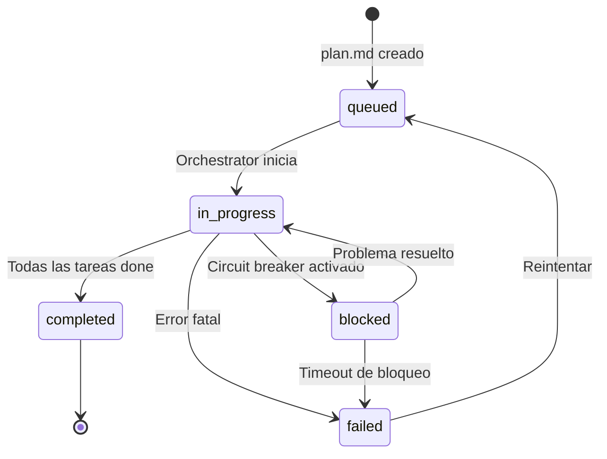
```mermaid
stateDiagram-v2
    [*] --> queued: plan.md creado
    queued --> in_progress: Orchestrator inicia
    in_progress --> completed: Todas las tareas done
    in_progress --> blocked: Circuit breaker activado
    in_progress --> failed: Error fatal
    blocked --> in_progress: Problema resuelto
    blocked --> failed: Timeout de bloqueo
    failed --> queued: Reintentar
    completed --> [*]
```

### 6.3. Diagrama de Estados de una Tarea

```mermaid
stateDiagram-v2
    [*] --> queued: Tarea agregada al plan
    queued --> running: Worker spawneado
    running --> done: Éxito + validación OK
    running --> fail: Error o validación fallida
    running --> cancelled: Señal de usuario
    fail --> running: Reintentar (< max_retries)
    fail --> blocked: Reintentos agotados
    cancelled --> queued: Re-encolar (opción)
    done --> [*]
    blocked --> [*]
```

### 6.4. Modelo de Datos del State Manager

```mermaid
erDiagram
    PLAN ||--o{ TASK : contiene
    TASK }o--|| PLAN : pertenece
    TASK ||--o{ WORKER : asignado_a
    TASK ||--o{ VALIDATOR : validado_por
    WORKER }o--|| TASK : ejecuta
    VALIDATOR }o--|| TASK : verifica

    PLAN {
        string plan_id PK
        string version
        datetime created_at
        datetime updated_at
        string status
        json config
        json token_budget
        json metrics
    }

    TASK {
        string id PK
        string title
        string tier
        string model
        string status
        string assigned_to FK
        string validator_id FK
        string[] dependencies
        int retry_count
        int tokens_used
        datetime started_at
        datetime completed_at
        json output
    }

    WORKER {
        string worker_id PK
        string task_id FK
        string status
        int tokens_used
        datetime spawned_at
        datetime terminated_at
    }

    VALIDATOR {
        string validator_id PK
        string task_id FK
        boolean valid
        json issues
        int tokens_used
    }
```

---

## 7. Concurrencia y Cola de Escritura Atómica

### 7.1. Problema: Race Conditions

Cuando múltiples subagentes intentan actualizar el estado simultáneamente, se produce un problema de **condiciones de carrera** (race conditions). Sin un mecanismo de sincronización, las escrituras pueden sobreescribirse mutativamente.

### 7.2. Solución: Write Queue

```mermaid
graph LR
    subgraph "Subagentes (concurrentes)"
        W1["Worker 1"]
        W2["Worker 2"]
        W3["Worker 3"]
    end

    subgraph "State Manager (Main Thread)"
        IM["In-Memory State<br/>(Objeto TypeScript)"]
        WQ["Write Queue<br/>(FIFO Channel)"]
    end

    subgraph "Persist Worker (Worker Thread)"
        PW["Persist Worker<br/>(Thread separado)"]
        TMP["plan.tmp.md<br/>(Archivo temporal)"]
    end

    subgraph "File System"
        PLAN["plan.md<br/>(Archivo final)"]
    end

    W1 & W2 & W3 -->|"state update"| IM
    IM -->|"enqueue"| WQ
    WQ -->|"dequeue"| PW
    PW -->|"escribir"| TMP
    TMP -->|"rename atómico"| PLAN
```

### 7.3. Flujo de Escritura Atómica

```mermaid
sequenceDiagram
    participant W1 as Worker 1
    participant W2 as Worker 2
    participant SM as State Manager
    participant WQ as Write Queue
    participant PW as Persist Worker
    participant FS as File System

    Note over W1,W2: Workers terminan casi simultáneamente
    W1->>SM: update_task(task-001, status=done)
    W2->>SM: update_task(task-002, status=done)
    SM->>SM: Actualizar objeto en memoria
    SM->>WQ: enqueue({task: "001", status: "done"})
    SM->>WQ: enqueue({task: "002", status: "done"})

    loop Para cada item en la cola
        WQ->>PW: dequeue()
        PW->>PW: Serializar YAML completo
        PW->>FS: writeFileSync("plan.tmp.md")
        PW->>FS: rename("plan.tmp.md", "plan.md")
        Note over FS: rename = operación atómica en POSIX
    end
```

### 7.4. Garantías de Atomicidad

| Propiedad | Implementación |
| --- | --- |
| **Serialización** | La cola FIFO procesa escrituras en orden |
| **Atomicidad** | `rename()` en POSIX es atómico dentro del mismo filesystem |
| **Consistencia** | El estado en memoria siempre refleja la última cola procesada |
| **Durabilidad** | El plan.md siempre está en un estado consistente |
| **Aislamiento** | El Persist Worker corre en un Worker Thread separado |

### 7.5. Diagrama de la Cola de Mensajes

```mermaid
graph TB
    subgraph "Entrada"
        U1["update: task-001 → done"]
        U2["update: task-002 → running"]
        U3["update: task-003 → fail"]
    end

    subgraph "Write Queue (FIFO)"
        Q1["Front → task-001 done"]
        Q2["task-002 running"]
        Q3["task-003 fail ← Rear"]
    end

    subgraph "Procesamiento"
        P1["Serializar a YAML"]
        P2["Write plan.tmp.md"]
        P3["rename → plan.md"]
    end

    U1 & U2 & U3 --> Q1
    Q1 --> Q2 --> Q3
    Q3 --> P1 --> P2 --> P3

    style Q1 fill:#4CAF50,color:#fff
    style Q2 fill:#FF9800,color:#fff
    style Q3 fill:#f44336,color:#fff
```

---

## 8. Observabilidad e Interfaz TUI

### 8.1. Inspiración de Diseño

La interfaz se inspira en flujos dinámicos de terminal modernos como Claude Code, con una estética limpia y funcional.

### 8.2. Layout de la TUI

```text
┌─────────────────────────────────────────────────────────────────────┐
│  🐙 PI ORCHESTRATOR                                    [F1] Help   │
├─────────────────────────────────────────────────────────────────────┤
│  Plan: auth-module              Status: ▶ In Progress               │
│  Tasks: 3/8 done   Workers: 2 active   Elapsed: 00:12:34            │
├─────────────────────────────────────────────────────────────────────┤
│                                                                     │
│  Phase 1: Database Layer                                            │
│  ┌─────────────────────────────────────────────────────────────┐    │
│  │ ✅ T-001  Definir schema              light   haiku  0.4s  │    │
│  │ 🔄 T-002  Crear migration             medium  sonnet  ...  │    │
│  │ 🔄 T-003  Implementar seeders         medium  sonnet  ...  │    │
│  └─────────────────────────────────────────────────────────────┘    │
│                                                                     │
│  Phase 2: API Layer                                                 │
│  ┌─────────────────────────────────────────────────────────────┐    │
│  │ ⏳ T-004  Crear endpoints CRUD        medium  sonnet  queue │   │
│  │ ⏳ T-005  Implementar auth middleware  medium  sonnet  queue│   │
│  └─────────────────────────────────────────────────────────────┘    │
│                                                                     │
│  Phase 3: Frontend                                                  │
│  ┌─────────────────────────────────────────────────────────────┐   │
│  │ ⏳ T-006  Crear componentes React     medium  sonnet  queue │   │
│  │ ⏳ T-007  Implementar formularios     medium  sonnet  queue │   │
│  └─────────────────────────────────────────────────────────────┘   │
│                                                                     │
│  Phase 4: Testing                                                   │
│  ┌─────────────────────────────────────────────────────────────┐   │
│  │ ⏳ T-008  Tests unitarios             light   haiku  queue │   │
│  │ ⏳ T-009  Tests de integración        heavy   opus   queue │   │
│  └─────────────────────────────────────────────────────────────┘   │
│                                                                     │
├─────────────────────────────────────────────────────────────────────┤
│  📊 Tokens: O:12.5k │ W:45.2k │ V:8.1k │ Total: 65.8k/500k         │
│  🕐 ETA: ~15min │ Speed: 3.2 tasks/min                             │
├─────────────────────────────────────────────────────────────────────┤
│  [c] Cancel  [p] Pause  [r] Resume  [Enter] Drill-Down  [q] Quit    │
└─────────────────────────────────────────────────────────────────────┘
```

### 8.3. Componentes de la TUI

```mermaid
graph TB
    subgraph "TUI Dashboard"
        HEADER["Header<br/>Plan name, Status, Metrics"]
        TREE["Task Tree<br/>Phases > Tasks > Subtasks"]
        STATS["Stats Bar<br/>Tokens, ETA, Speed"]
        FOOTER["Footer<br/>Keyboard Shortcuts"]
    end

    subgraph "Data Source"
        SM["State Manager<br/>(In-Memory)"]
    end

    SM -->|"60fps updates"| HEADER
    SM -->|"event-driven"| TREE
    SM -->|"real-time"| STATS
    SM -->|"static"| FOOTER
```

### 8.4. Sistema de Colores de la TUI

```mermaid
graph LR
    DONE["✅ Done<br/>#4CAF50<br/>Verde"]
    RUNNING["🔄 Running<br/>#FF9800<br/>Naranja"]
    QUEUED["⏳ Queued<br/>#9E9E9E<br/>Gris"]
    BLOCKED["🚫 Blocked<br/>#f44336<br/>Rojo"]
    CANCELLED["❌ Cancelled<br/>#9C27B0<br/>Púrpura"]

    DONE -->|"completada"| DONE
    RUNNING -->|"éxito"| DONE
    RUNNING -->|"fallo"| BLOCKED
    QUEUED -->|"asignada"| RUNNING
    BLOCKED -->|"resuelta"| RUNNING
```

### 8.5. Flujo de Renderizado de la TUI

```mermaid
sequenceDiagram
    participant U as Usuario
    participant TUI as TUI Renderer
    participant SM as State Manager
    participant FS as File System

    loop 60 FPS
        SM->>TUI: onStateChange(event)
        TUI->>TUI: Recalcular layout
        TUI->>TUI: Renderizar componentes
        TUI->>U: Actualizar terminal
    end

    U->>TUI: Key press (c, p, r, Enter)
    TUI->>SM: dispatchAction(action)
    SM->>FS: Persistir cambio
```

---

## 9. Controles Dinámicos y Atajos de Teclado

### 9.1. Tabla de Atajos

| Atajo | Acción | Descripción |
| --- | --- | --- |
| `↑` / `↓` | Navegar | Mover cursor entre tareas |
| `←` / `→` | Expandir/Colapsar | Mostrar/ocultar subtareas |
| `[c]` | Cancelar | Enviar AbortController al worker |
| `[p]` | Pausar | Suspender ejecución del worker |
| `[r]` | Reanudar | Reanudar worker o reintentar |
| `[Enter]` | Drill-Down | Expandir para ver logs en tiempo real |
| `[Esc]` | Volver | Salir de vista drill-down |
| `[q]` | Salir | Terminar orchestrator y guardar estado |
| `[?]` | Help | Mostrar overlay de ayuda |
| `[s]` | Stats | Alternar vista de métricas detalladas |

### 9.2. Flujo de Cancelación

```mermaid
sequenceDiagram
    participant U as Usuario
    participant TUI as TUI
    participant SM as State Manager
    participant AC as AbortController
    participant W as Worker
    participant FS as File System

    U->>TUI: Presiona [c] sobre task-002
    TUI->>SM: dispatch({type: CANCEL, taskId: "task-002"})
    SM->>AC: abort("task-002")
    AC->>W: Señal de cancelación
    W->>W: Detener ejecución
    W->>SM: update({status: "cancelled"})
    SM->>FS: Mover archivos a ./output/.trash/task-002/
    SM->>FS: Actualizar plan.md → status: "queued"
    SM->>TUI: State update → re-render
    TUI->>U: Tarea cancelada, re-encolada
```

### 9.3. Flujo de Pausa/Reanudación

```mermaid
sequenceDiagram
    participant U as Usuario
    participant TUI as TUI
    participant SM as State Manager
    participant W as Worker

    Note over U,W: Flujo de Pausa
    U->>TUI: Presiona [p]
    TUI->>SM: dispatch({type: PAUSE, taskId: "task-002"})
    SM->>W: signal(SIGSTOP) o suspend()
    W->>W: Pausar ejecución
    W->>SM: update({status: "paused"})
    SM->>TUI: Re-render

    Note over U,W: Flujo de Reanudación
    U->>TUI: Presiona [r]
    TUI->>SM: dispatch({type: RESUME, taskId: "task-002"})
    SM->>W: signal(SIGCONT) o resume()
    W->>W: Reanudar ejecución
    W->>SM: update({status: "running"})
    SM->>TUI: Re-render
```

### 9.4. Flujo de Drill-Down

```mermaid
sequenceDiagram
    participant U as Usuario
    participant TUI as TUI
    participant SM as State Manager
    participant W as Worker

    U->>TUI: Presiona [Enter] sobre task-002
    TUI->>SM: getState("task-002")
    SM-->>TUI: Datos completos de la tarea
    TUI->>TUI: Cambiar a vista drill-down

    Note over TUI: Mostrar logs del worker en tiempo real

    loop Mientras worker esté activo
        W->>SM: onLog(message)
        SM->>TUI: broadcast(logEvent)
        TUI->>U: Actualizar vista de logs
    end

    U->>TUI: Presiona [Esc]
    TUI->>TUI: Volver a vista de árbol
```

### 9.5. Diagrama de Estados de la TUI

```mermaid
stateDiagram-v2
    [*] --> TreeView: Inicio
    TreeView --> DrillDown: Enter
    DrillDown --> TreeView: Esc
    TreeView --> HelpOverlay: ?
    HelpOverlay --> TreeView: Esc
    TreeView --> StatsOverlay: s
    StatsOverlay --> TreeView: s
    TreeView --> ConfirmCancel: c
    ConfirmCancel --> TreeView: Esc
    ConfirmCancel --> CancelAction: Enter
    CancelAction --> TreeView
```

---

## 10. Seguridad y Sandboxing

### 10.1. Aislamiento de Herramientas

```mermaid
graph TB
    subgraph "Orchestrator (Main Thread)"
        TOOLS_O["Herramientas:<br/>• bash<br/>• read<br/>• write<br/>• edit<br/>• spawn_subagent<br/>• abort_task<br/>• pause_task<br/>• resume_task"]
    end

    subgraph "Worker (Child Process)"
        TOOLS_W["Herramientas:<br/>• bash<br/>• read<br/>• write<br/>• edit"]
    end

    subgraph "Validator (Child Process)"
        TOOLS_V["Herramientas:<br/>• read<br/>• bash (solo validación)"]
    end

    TOOLS_O -.->|"NUNCA hereda"| TOOLS_W
    TOOLS_O -.->|"NUNCA hereda"| TOOLS_V
```

### 10.2. Sandboxing de Archivos

```mermaid
graph TB
    subgraph "File System Restriction"
        ROOT["./"]
        PROJECT["./src/"]
        OUTPUT["./output/"]
        TASK_OUT["./output/{task_id}/"]
        TRASH["./output/.trash/"]
    end

    subgraph "Worker Sandbox"
        W_READ["✅ Lectura: ./src/**"]
        W_WRITE["✅ Escritura: ./output/{task_id}/**"]
        W_BLOCKED["❌ Bloqueado: ./output/.trash/**"]
        W_BLOCKED2["❌ Bloqueado: ./node_modules/**"]
    end

    ROOT --> PROJECT
    ROOT --> OUTPUT
    OUTPUT --> TASK_OUT
    OUTPUT --> TRASH

    W_READ --> PROJECT
    W_WRITE --> TASK_OUT
    W_BLOCKED -.->|"denegado"| TRASH
    W_BLOCKED2 -.->|"denegado"| ROOT
```

### 10.3. Reglas de Seguridad

| Regla | Descripción | Implementación |
| --- | --- | --- |
| **Sin Herencia** | Workers no heredan `spawn_subagent` | Validación en tiempo de spawn |
| **Sandbox Estricto** | I/O restringido a `./output/{task_id}/` | Path validation en herramientas |
| **Sin Recursión** | Workers no pueden crear workers | Tool whitelist por sesión |
| **Timeout Global** | Límite de tiempo por tarea | AbortController con timeout |
| **Resource Limits** | Límite de tokens por tarea | Token budget tracking |

---

## 11. Prevención de Riesgos y Mitigaciones (Red Team Rules)

### 11.1. Circuit Breaker de Validación

Si un par Worker→Validator entra en un bucle iterativo (Retry → Fail → Retry), el límite máximo de iteraciones es **3**. Al alcanzar el límite, el Orquestador etiqueta la tarea como `blocked`, pausa el árbol de dependencias asociado y alerta en la TUI.

```mermaid
stateDiagram-v2
    [*] --> Healthy
    Healthy --> HalfOpen: 1er fallo
    HalfOpen --> Healthy: Re-intento exitoso
    HalfOpen --> Broken: 2do fallo
    Broken --> Open: 3er fallo (Circuit Breaker)
    Open --> Blocked: Límite alcanzado
    Open --> HalfOpen: Reset timer
    Blocked --> [*]: Alerta al usuario

    note right of Healthy: Worker→Validator OK
    note right of HalfOpen: 1-2 reintentos
    note right of Open: 3 reintentos
    note right of Blocked: Tarea congelada
```

### 11.2. Diagrama de Flujo del Circuit Breaker

```mermaid
flowchart TD
    START([Worker completa tarea]) --> VALIDATE["Spawnear Validator"]
    VALIDATE --> CHECK{¿Validación OK?}

    CHECK -->|Sí| SUCCESS([Tarea completada])
    CHECK -->|No| RETRY_COUNT{¿Intentos < 3?}

    RETRY_COUNT -->|Sí| RE_SPAWN["Re-spawn Worker"]
    RE_SPAWN --> START

    RETRY_COUNT -->|No| BREAKER["Circuit Breaker ACTIVADO"]
    BREAKER --> MARK_BLOCKED["Marcar tarea: blocked"]
    MARK_BLOCKED --> PAUSE_DEPS["Pausar dependencias"]
    PAUSE_DEPS --> ALERT["Alerta en TUI"]
    ALERT --> WAIT_USER([Esperar decisión del usuario])

    WAIT_USER -->|Reintentar| RE_SPAWN
    WAIT_USER -->|Cancelar| CANCEL["Mover a .trash"]
    CANCEL --> RESUME_DEPS["Reanudar dependencias"]
```

### 11.3. Tabla de Mitigaciones

| Riesgo | Mitigación | Límite | Acción al Límite |
| --- | --- | --- | --- |
| Bucle infinito de reintentos | Circuit Breaker | 3 iteraciones | Marcar `blocked` |
| Workers creando workers | Tool restriction | Prohibido | Error inmediato |
| Escrituras concurrentes | Write Queue FIFO | N/A | Serialización |
| Uso excesivo de tokens | Token budget | 500k/ventana | Pausar workers |
| Workers colgados | Timeout global | 300s/tarea | Abort + re-encolar |
| Archivos corruptos | Atomic write (rename) | N/A | Rollback automático |
| Subagente malicioso | Sandbox de archivos | `./output/{id}/` | Denegar acceso |

---

## 12. Flujo de Datos End-to-End

### 12.1. Diagrama de Flujo Completo

```mermaid
flowchart TB
    subgraph "Entrada"
        USER["Usuario"]
        PLAN["plan.md"]
        CONFIG["Configuración"]
    end

    subgraph "Procesamiento"
        PARSE["Parser YAML"]
        DAG["DAG Resolver"]
        TIER["Tier Assigner"]
        SCHED["Scheduler"]
    end

    subgraph "Ejecución"
        ORCH["Orchestrator"]
        W1["Worker Pool"]
        V1["Validator Pool"]
        CB["Circuit Breaker"]
    end

    subgraph "Estado"
        IM["In-Memory State"]
        WQ["Write Queue"]
        PW["Persist Worker"]
    end

    subgraph "Salida"
        PLAN2["plan.md (actualizado)"]
        OUTPUT["./output/"]
        TUI["TUI Dashboard"]
    end

    USER --> PLAN
    USER --> CONFIG
    PLAN --> PARSE
    CONFIG --> PARSE
    PARSE --> DAG
    DAG --> TIER
    TIER --> SCHED
    SCHED --> ORCH
    ORCH --> W1
    W1 --> V1
    V1 --> CB
    CB --> IM
    IM --> WQ
    WQ --> PW
    PW --> PLAN2
    W1 --> OUTPUT
    IM --> TUI
```

### 12.2. Flujo de Datos por Capa

```mermaid
graph LR
    subgraph "Capa 1: Input"
        A["plan.md<br/>+ config"]
    end

    subgraph "Capa 2: Parse"
        B["YAML extracted<br/>+ DAG built"]
    end

    subgraph "Capa 3: Schedule"
        C["Tasks queued<br/>+ Tiers assigned"]
    end

    subgraph "Capa 4: Execute"
        D["Workers spawned<br/>+ Validators running"]
    end

    subgraph "Capa 5: State"
        E["In-memory updated<br/>+ Queue filled"]
    end

    subgraph "Capa 6: Persist"
        F["Atomic write<br/>to plan.md"]
    end

    subgraph "Capa 7: Output"
        G["Files in ./output/<br/>+ TUI updated"]
    end

    A --> B --> C --> D --> E --> F --> G
```

---

## 13. Modelos de LLM y Tiers de Complejidad

### 13.1. Tabla de Tiers

| Tier | Modelo | Caso de Uso | Costo relativo | Velocidad |
| --- | --- | --- | --- | --- |
| **light** | Claude 3.5 Haiku | Tareas simples: CRUD, config, docs | 1x | Muy rápido |
| **medium** | Claude 3.5 Sonnet | Tareas intermedias: APIs, lógica, tests | 5x | Rápido |
| **heavy** | Claude 3.5 Opus | Tareas complejas: arquitectura, algoritmos | 25x | Normal |

### 13.2. Criterios de Asignación

```mermaid
flowchart TD
    TASK["Tarea"] --> ANALYSIS{"Analizar tarea"}

    ANALYSIS -->|"Definición simple<br/>CRUD, config, docs"| LIGHT["Tier: light<br/>Model: haiku"]
    ANALYSIS -->|"Lógica de negocio<br/>APIs, tests, refactor"| MEDIUM["Tier: medium<br/>Model: sonnet"]
    ANALYSIS -->|"Arquitectura compleja<br/>Algoritmos, seguridad"| HEAVY["Tier: heavy<br/>Model: opus"]

    LIGHT --> COST1["~$0.01/tarea"]
    MEDIUM --> COST2["~$0.05/tarea"]
    HEAVY --> COST3["~$0.25/tarea"]
```

### 13.3. Diagrama de Asignación por Complejidad

```mermaid
quadrantChart
    title Asignación de Modelos por Complejidad
    x-axis "Simple" --> "Complejo"
    y-axis "Poco Crítico" --> "Muy Crítico"
    quadrant-1 "Heavy (Opus)"
    quadrant-2 "Medium (Sonnet)"
    quadrant-3 "Light (Haiku)"
    quadrant-4 "Medium (Sonnet)"
    "Config JSON": [0.2, 0.2]
    "CRUD API": [0.3, 0.4]
    "Auth middleware": [0.6, 0.8]
    "Schema design": [0.5, 0.6]
    "Arquitectura": [0.8, 0.9]
    "Algoritmo crypto": [0.9, 0.95]
```

---

## 14. Especificación de Protocolos

### 14.1. Protocolo de Comunicación Orchestrator↔Worker

```mermaid
sequenceDiagram
    participant O as Orchestrator
    participant W as Worker

    O->>W: spawn_task(JSON)
    Note left of O: { task_id, prompt,<br/>model, sandbox_path,<br/>timeout_ms, tools }

    W->>W: Ejecutar tarea
    W-->>O: onProgress(percent, message)

    alt Éxito
        W-->>O: onResult({status: "done", output: {...}})
    else Fallo
        W-->>O: onResult({status: "fail", error: "..."})
    end

    O->>O: Procesar resultado
```

### 14.2. Protocolo de Comunicación Orchestrator↔Validator

```mermaid
sequenceDiagram
    participant O as Orchestrator
    participant V as Validator

    O->>V: validate_task(JSON)
    Note left of O: { task_id,<br/>worker_output,<br/>validation_rules }

    V->>V: Ejecutar validaciones
    V-->>O: onResult({valid: bool, issues: [...]})

    O->>O: Evaluar resultado
```

### 14.3. Protocolo de Comunicación State Manager↔TUI

```mermaid
graph LR
    subgraph "State Manager"
        EM["EventEmitter"]
    end

    subgraph "TUI Dashboard"
        SUB["Subscriber"]
    end

    subgraph "Eventos"
        E1["onTaskUpdate"]
        E2["onTokenUsage"]
        E3["onWorkerSpawn"]
        E4["onWorkerTerminate"]
        E5["onError"]
    end

    EM --> E1 & E2 & E3 & E4 & E5
    E1 & E2 & E3 & E4 & E5 --> SUB
```

### 14.4. Formatos de Mensajes

#### Task Spawn Request

```json
{
  "type": "spawn_task",
  "task_id": "task-002",
  "title": "Crear migration de la base de datos",
  "prompt": "Crea una migración para la tabla de usuarios...",
  "model": "sonnet",
  "tier": "medium",
  "sandbox_path": "./output/task-002/",
  "timeout_ms": 300000,
  "tools": ["bash", "read", "write", "edit"],
  "validation_rules": {
    "required_files": ["migrations/002_create_users.sql"],
    "max_tokens": 5000
  }
}
```

#### Worker Result

```json
{
  "type": "worker_result",
  "task_id": "task-002",
  "worker_id": "worker-xyz-789",
  "status": "done",
  "output": {
    "files_created": ["migrations/002_create_users.sql"],
    "summary": "Migración creada con campos id, email, password_hash",
    "tokens_used": 2340,
    "duration_ms": 15200
  },
  "error": null,
  "timestamp": "2026-07-03T10:31:15.200Z"
}
```

#### Validator Result

```json
{
  "type": "validator_result",
  "task_id": "task-002",
  "validator_id": "val-abc-456",
  "valid": true,
  "issues": [],
  "checks_performed": [
    {"check": "files_exist", "passed": true, "details": "1 file found"},
    {"check": "sql_syntax", "passed": true, "details": "Valid SQL"},
    {"check": "output_format", "passed": true, "details": "JSON format OK"}
  ],
  "tokens_used": 340,
  "timestamp": "2026-07-03T10:31:16.500Z"
}
```

---

## 15. Fases de Implementación

### 15.1. Roadmap Visual

```mermaid
gantt
    title Pi Orchestrator — Roadmap de Implementación
    dateFormat  YYYY-MM-DD
    axisFormat  %b %d

    section Fase 1: Motor Base
    Definir prompts (orchestrator.md, worker.md, validator.md) :a1, 2026-07-01, 3d
    State Manager (JSON in-memory) :a2, after a1, 4d
    Write Queue atómica a plan.md :a3, after a2, 3d
    Tests unitarios del Core :a4, after a3, 2d

    section Fase 2: Extensión
    Crear spawn_subagent :b1, after a4, 3d
    Gestor de sesiones (aislamiento) :b2, after b1, 3d
    Circuit Breaker (límite: 3) :b3, after b2, 2d
    Tests de integración :b4, after b3, 2d

    section Fase 3: TUI MVP
    Renderizado de tabla de estado :c1, after b4, 4d
    Contador de métricas/tokens :c2, after c1, 3d
    Tests visuales :c3, after c2, 2d

    section Fase 4: Interactividad
    AbortControllers + keybindings :d1, after c3, 4d
    Rutina "Trash" para archivos :d2, after d1, 2d
    Pausa/Reanudación :d3, after d2, 2d
    Tests de interactividad :d4, after d3, 2d

    section Fase 5: Empaquetado
    Empaquetar como npm plugin :e1, after d4, 3d
    Pruebas de estrés de concurrencia :e2, after e1, 3d
    Validación token budget :e3, after e2, 2d
    Documentación y release :e4, after e3, 2d
```

### 15.2. Dependencias entre Fases

```mermaid
graph TD
    F1["Fase 1: Motor Base"] --> F2["Fase 2: Extensión"]
    F2 --> F3["Fase 3: TUI MVP"]
    F3 --> F4["Fase 4: Interactividad"]
    F4 --> F5["Fase 5: Empaquetado"]

    F1 -->|"State Manager"| F1A["State Manager"]
    F1 -->|"Write Queue"| F1B["Write Queue"]
    F2 -->|"spawn_subagent"| F2A["Subagent Spawner"]
    F2 -->|"Circuit Breaker"| F2B["Circuit Breaker"]
    F3 -->|"TUI Renderer"| F3A["TUI"]
    F4 -->|"AbortController"| F4A["Cancel System"]
    F4 -->|"Trash Routine"| F4B["Trash Manager"]
    F5 -->|"npm package"| F5A["@pi-orch/orchestrator"]

    F1A --> F2A
    F1B --> F2B
    F2A --> F3A
    F2B --> F4A
    F3A --> F4B
    F4A --> F5A
    F4B --> F5A
```

### 15.3. Detalle por Fase

#### Fase 1: Motor Base y Estado

| Entregable | Descripción | Criterio de Aceptación |
| --- | --- | --- |
| `prompts/orchestrator.md` | System prompt del orquestador | Genera JSON válido de plan |
| `prompts/worker.md` | System prompt del worker | Ejecuta tarea y retorna JSON |
| `prompts/validator.md` | System prompt del validator | Valida output sin modificar |
| `src/state-manager.ts` | State Manager in-memory | CRUD de tareas sin persistir |
| `src/write-queue.ts` | Cola FIFO de escrituras | Serializa cambios correctamente |
| `src/persist-worker.ts` | Worker Thread de persistencia | Atomicidad con rename |
| `tests/` | Tests unitarios | Coverage &gt; 80% |

#### Fase 2: Extensión de Orquestación

| Entregable | Descripción | Criterio de Aceptación |
| --- | --- | --- |
| `src/spawn-subagent.ts` | Tool de spawning | Crea sesiones aisladas |
| `src/session-manager.ts` | Gestor de sesiones | Aislamiento verificable |
| `src/circuit-breaker.ts` | Circuit Breaker | Límite de 3 reintentos |
| `tests/` | Tests de integración | Flujos completos verificados |

#### Fase 3: Observabilidad Visual (TUI MVP)

| Entregable | Descripción | Criterio de Aceptación |
| --- | --- | --- |
| `src/tui/tree-view.ts` | Renderizado de árbol | Muestra fases y tareas |
| `src/tui/stats-bar.ts` | Barra de métricas | Conteo de tokens en tiempo real |
| `tests/` | Tests visuales | Snapshot tests |

#### Fase 4: Interactividad Avanzada

| Entregable | Descripción | Criterio de Aceptación |
| --- | --- | --- |
| `src/tui/keybindings.ts` | Captura de atajos | \[c\], \[p\], \[r\], \[Enter\] funcionan |
| `src/abort-controller.ts` | AbortController pool | Cancelación limpia de workers |
| `src/trash-manager.ts` | Rutina Trash | Archivos movidos a `.trash/` |
| `tests/` | Tests de interactividad | Simulación de teclado |

#### Fase 5: Empaquetado y Testing

| Entregable | Descripción | Criterio de Aceptación |
| --- | --- | --- |
| `package.json` | Paquete npm | `@pi-orch/orchestrator` publicable |
| `tests/stress/` | Pruebas de estrés | 20+ workers concurrentes |
| `tests/token-budget/` | Validación de presupuesto | Budget respeta límites |
| `README.md` | Documentación | Quick start + API reference |

---

## 16. Métricas y Observabilidad

### 16.1. Métricas por Nivel

```mermaid
graph TB
    subgraph "Nivel 1: Global"
        G1["Total Tokens Usados"]
        G2["Tiempo Total de Ejecución"]
        G3["Tasa de Éxito"]
        G4["Costo Estimado"]
    end

    subgraph "Nivel 2: Por Fase"
        F1["Tokens por Fase"]
        F2["Duración por Fase"]
        F3["Tareas completadas por Fase"]
    end

    subgraph "Nivel 3: Por Tarea"
        T1["Tokens por Tarea"]
        T2["Duración por Tarea"]
        T3["Reintentos por Tarea"]
        T4["Modelo Asignado"]
    end

    subgraph "Nivel 4: Por Subagente"
        S1["Worker: tokens, duración, archivos"]
        S2["Validator: tokens, checks, issues"]
    end

    G1 & G2 & G3 & G4 --> F1 & F2 & F3
    F1 & F2 & F3 --> T1 & T2 & T3 & T4
    T1 & T2 & T3 & T4 --> S1 & S2
```

### 16.2. Fórmulas de Métricas

| Métrica | Fórmula | Descripción |
| --- | --- | --- |
| **Token Rate** | `tokens_used / elapsed_seconds` | Tokens por segundo |
| **Task Throughput** | `completed_tasks / elapsed_minutes` | Tareas por minuto |
| **Success Rate** | `completed / (completed + failed) * 100` | Porcentaje de éxito |
| **Retry Rate** | `total_retries / total_tasks * 100` | Porcentaje de reintentos |
| **Est. Cost** | `sum(token_count * price_per_token)` | Costo estimado en USD |
| **ETA** | `remaining_tasks / task_throughput` | Tiempo estimado restante |

### 16.3. Dashboard de Métricas

```text
┌──────────────────────────────────────────────────────────────┐
│  📊 DASHBOARD DE MÉTRICAS                                    │
├──────────────────────────────────────────────────────────────┤
│                                                              │
│  Tokens por Tier:                                            │
│  ████████████░░░░░░░░░░  Light:  25.3k (20%)                │
│  ████████████████████░░  Medium: 85.2k (68%)                │
│  ██████░░░░░░░░░░░░░░░░  Heavy:  15.1k (12%)                │
│                                                              │
│  Tokens por Rol:                                             │
│  ████████████░░░░░░░░░░  Orchestrator: 12.5k (10%)          │
│  ████████████████████░░  Workers:      95.2k (76%)           │
│  ████░░░░░░░░░░░░░░░░░░  Validators:  17.9k (14%)           │
│                                                              │
│  Velocidad: 3.2 tasks/min  │  Éxito: 95%  │  Retries: 2     │
│                                                              │
└──────────────────────────────────────────────────────────────┘
```

---

## 17. Casos de Uso y Escenarios

### 17.1. Caso de Uso: Módulo de Autenticación Completo

```mermaid
sequenceDiagram
    actor U as Desarrollador
    participant O as Orchestrator
    participant W1 as Worker 1
    participant W2 as Worker 2
    participant W3 as Worker 3
    participant V as Validator

    U->>O: Ejecutar plan: auth-module

    Note over O: Fase 1: Database
    O->>W1: T1: Definir schema (haiku)
    W1-->>O: ✅ done
    O->>V: Validar T1
    V-->>O: ✅ valid

    Note over O: Fase 2: API (paralelo)
    par Workers en paralelo
        O->>W2: T2: Login endpoint (sonnet)
        O->>W3: T3: Register endpoint (sonnet)
    end
    W2-->>O: ✅ done
    W3-->>O: ✅ done
    O->>V: Validar T2 y T3
    V-->>O: ✅ valid

    Note over O: Fase 3: Tests
    O->>W1: T4: Tests unitarios (haiku)
    W1-->>O: ✅ done
    O->>V: Validar T4
    V-->>O: ✅ valid

    O-->>U: 🎉 Módulo completado
```

### 17.2. Caso de Uso: Manejo de Error con Circuit Breaker

```mermaid
sequenceDiagram
    participant O as Orchestrator
    participant W as Worker
    participant V as Validator

    Note over O,V: Primer intento
    O->>W: T1: Implementar algo complejo
    W-->>O: done
    O->>V: Validar
    V-->>O: ❌ fail: "Archivo no existe"

    Note over O,V: Segundo intento
    O->>W: Re-spawn
    W-->>O: done
    O->>V: Validar
    V-->>O: ❌ fail: "Error de sintaxis"

    Note over O,V: Tercer intento
    O->>W: Re-spawn
    W-->>O: done
    O->>V: Validar
    V-->>O: ❌ fail: "Output incompleto"

    Note over O: Circuit Breaker: 3/3 fallos
    O->>O: Marcar T1 como blocked
    O->>O: Pausar dependencias
    O-->>O: Alerta en TUI
```

### 17.3. Caso de Uso: Cancelación y Re-encolado

```mermaid
sequenceDiagram
    actor U as Desarrollador
    participant TUI as TUI
    participant O as Orchestrator
    participant W as Worker
    participant FS as File System

    U->>TUI: [c] sobre T3 (running)
    TUI->>O: Cancelar T3
    O->>W: Señal abort
    W->>W: Detener
    O->>FS: Mover output a .trash/
    O->>O: T3 → queued
    O->>O: Re-encolar T3
    TUI->>U: T3 cancelada, re-encolada

    Note over O: Worker nuevo asignado
    O->>W: Nuevo worker para T3
    W-->>O: done
    O->>U: T3 completada exitosamente
```

---

## 18. Diagramas de Arquitectura Completa

### 18.1. Arquitectura de Capas Completa

```mermaid
graph TB
    subgraph "🎨 Presentación"
        TUI["TUI Dashboard<br/>(React Ink / Blessed)"]
        CLI["CLI Interface<br/>(Commander.js)"]
        KEY["Keybinding Manager"]
    end

    subgraph "🧠 Orquestación"
        ORCH["Orchestrator<br/>(Agente Principal)"]
        PARSER["Plan Parser<br/>(YAML + Markdown)"]
        DAG["DAG Resolver<br/>(Topological Sort)"]
        TIER["Tier Assigner<br/>(Complexity Analyzer)"]
        SCHED["Task Scheduler<br/>(Priority Queue)"]
    end

    subgraph "⚙️ Ejecución"
        SPAWNER["Subagent Spawner"]
        SESSION["Session Manager"]
        CB["Circuit Breaker"]
        AC["Abort Controller Pool"]
        W_POOL["Worker Pool<br/>(Child Processes)"]
        V_POOL["Validator Pool<br/>(Child Processes)"]
    end

    subgraph "💾 Persistencia"
        SM["State Manager<br/>(In-Memory Object)"]
        WQ["Write Queue<br/>(FIFO Channel)"]
        PW["Persist Worker<br/>(Worker Thread)"]
        FS["File System<br/>(plan.md)"]
    end

    subgraph "📊 Observabilidad"
        TC["Token Counter"]
        AGG["Metrics Aggregator"]
        LOG["Log Collector"]
        BCAST["Status Broadcaster"]
    end

    TUI --> ORCH
    CLI --> ORCH
    KEY --> TUI

    ORCH --> PARSER --> DAG --> TIER --> SCHED
    SCHED --> SPAWNER
    SPAWNER --> SESSION
    SESSION --> W_POOL
    SESSION --> V_POOL
    CB --> AC

    W_POOL --> SM
    V_POOL --> SM
    SM --> WQ --> PW --> FS

    SM --> TC --> AGG
    AGG --> LOG --> BCAST --> TUI
```

### 18.2. Grafo de Comunicación entre Componentes

```mermaid
graph LR
    TUI <-->|"State Events"| ORCH
    ORCH <-->|"Task Commands"| SPAWNER
    SPAWNER <-->|"Process I/O"| W_POOL
    W_POOL <-->|"Results"| V_POOL
    V_POOL <-->|"Validation"| ORCH
    ORCH <-->|"State Updates"| SM
    SM <-->|"Queue Items"| WQ
    WQ <-->|"Write Requests"| PW
    PW <-->|"File Ops"| FS
    SM <-->|"Metrics"| TC
    TC <-->|"Aggregated"| AGG
    AGG <-->|"Broadcast"| TUI

    style TUI fill:#2196F3,color:#fff
    style ORCH fill:#4CAF50,color:#fff
    style SM fill:#FF9800,color:#fff
    style FS fill:#9C27B0,color:#fff
```

---

## 19. Backlog y Futuras Funcionalidades

### 19.1. Features Planeadas (Post-v1.0)

```mermaid
graph TB
    subgraph "v1.1"
        V1A["Persistencia SQLite"]
        V1B["Historial de planes"]
        V1C["Comparación de versiones"]
    end

    subgraph "v1.2"
        V2A["Web Dashboard"]
        V2B["API REST"]
        V2C["Webhooks"]
    end

    subgraph "v2.0"
        V3A["Distribuido (multi-máquina)"]
        V3B["Caché semántico"]
        V3C["Aprendizaje de patrones"]
    end

    V1A --> V2A
    V1B --> V2B
    V1C --> V2C
    V2A --> V3A
    V2B --> V3B
    V2C --> V3C
```

### 19.2. Tabla de Features

| Feature | Prioridad | Versión | Descripción |
| --- | --- | --- | --- |
| Persistencia SQLite | Alta | v1.1 | Reemplazar YAML con SQLite para planes complejos |
| Historial de planes | Media | v1.1 | Guardar versiones anteriores de planes |
| Web Dashboard | Alta | v1.2 | UI web para monitoreo remoto |
| API REST | Media | v1.2 | Interfaz programática |
| Webhooks | Baja | v1.2 | Notificaciones a sistemas externos |
| Multi-máquina | Alta | v2.0 | Ejecución distribuida |
| Caché semántico | Media | v2.0 | Reutilizar soluciones similares |
| Aprendizaje | Baja | v2.0 | Mejorar asignación de tiers con historial |

---

## 20. Apéndices

### 20.1. Estructura de Directorios del Proyecto

```text
pi-orchestrator/
├── SPEC.md                          # Este archivo
├── package.json                     # Paquete npm
├── tsconfig.json                    # Configuración TypeScript
├── .gitignore
├── README.md                        # Documentación de uso
│
├── prompts/
│   ├── orchestrator.md              # System prompt del orquestador
│   ├── worker.md                    # System prompt del worker
│   └── validator.md                 # System prompt del validator
│
├── src/
│   ├── index.ts                     # Entry point
│   ├── orchestrator.ts              # Core del orquestador
│   ├── state-manager.ts             # State Manager in-memory
│   ├── write-queue.ts               # Cola FIFO de escrituras
│   ├── persist-worker.ts            # Worker Thread de persistencia
│   ├── spawn-subagent.ts            # Tool de spawning
│   ├── session-manager.ts           # Gestor de sesiones
│   ├── circuit-breaker.ts           # Circuit Breaker
│   ├── abort-controller.ts          # Pool de AbortControllers
│   ├── trash-manager.ts             # Rutina de archivos cancelados
│   │
│   ├── tui/
│   │   ├── index.ts                 # Entry point TUI
│   │   ├── tree-view.ts             # Renderizado de árbol
│   │   ├── stats-bar.ts             # Barra de métricas
│   │   ├── keybindings.ts           # Captura de atajos
│   │   ├── drill-down.ts            # Vista detallada
│   │   └── themes.ts                # Temas de colores
│   │
│   └── utils/
│       ├── yaml-parser.ts           # Parser YAML frontmatter
│       ├── dag-resolver.ts          # Resolución de dependencias
│       ├── tier-assigner.ts         # Asignación de modelos
│       ├── token-counter.ts         # Conteo de tokens
│       └── file-sandbox.ts          # Restricción de archivos
│
├── tests/
│   ├── unit/
│   │   ├── state-manager.test.ts
│   │   ├── write-queue.test.ts
│   │   ├── circuit-breaker.test.ts
│   │   └── dag-resolver.test.ts
│   ├── integration/
│   │   ├── orchestrator-flow.test.ts
│   │   ├── worker-lifecycle.test.ts
│   │   └── validation-loop.test.ts
│   ├── stress/
│   │   ├── concurrent-workers.test.ts
│   │   └── token-budget.test.ts
│   └── visual/
│       └── tui-snapshots.test.ts
│
├── output/                          # Directorio de ejecución
│   ├── {task_id}/                   # Sandbox por tarea
│   └── .trash/                      # Archivos cancelados
│
└── docs/
    ├── architecture.md              # Documentación de arquitectura
    ├── api-reference.md             # Referencia de API
    └── troubleshooting.md           # Guía de resolución de problemas
```

### 20.2. Configuración del Proyecto

```json
{
  "name": "@pi-orch/orchestrator",
  "version": "0.1.0",
  "description": "Multi-agent orchestrator for Pi Agent",
  "main": "dist/index.js",
  "types": "dist/index.d.ts",
  "bin": {
    "pi-orch": "dist/cli.js"
  },
  "scripts": {
    "build": "tsc",
    "dev": "tsx watch src/index.ts",
    "test": "vitest",
    "test:stress": "vitest run tests/stress",
    "lint": "eslint src/",
    "typecheck": "tsc --noEmit"
  },
  "dependencies": {
    "@earendil-works/pi-coding-agent": "*",
    "yaml": "^2.4.0",
    "ink": "^5.0.0",
    "react": "^18.2.0"
  },
  "devDependencies": {
    "typescript": "^5.4.0",
    "vitest": "^1.6.0",
    "tsx": "^4.7.0"
  },
  "engines": {
    "node": ">=18.0.0"
  }
}
```

### 20.3. Referencias y Inspiraciones

| Proyecto | Aspecto Inspirado |
| --- | --- |
| **Claude Code** | Flujo de terminal dinámico y TUI |
| **Temporal.io** | Workflows atómicos y durabilidad |
| **Bull MQ** | Colas de mensajes y workers |
| **Docker Compose** | Orquestación de servicios |
| **Make/Gulp** | DAG de dependencias |
| **Kubernetes** | Circuit Breaker y health checks |

### 20.4. Métricas de Éxito

| Métrica | Target v1.0 | Target v2.0 |
| --- | --- | --- |
| **Tokens saved vs sequential** | 40% reduction | 60% reduction |
| **Parallelism speedup** | 2x faster | 4x faster |
| **Task success rate** | &gt; 90% | &gt; 95% |
| **Circuit breaker accuracy** | 100% catch infinite loops | N/A |
| **TUI FPS** | 30fps | 60fps |
| **Max concurrent workers** | 4 | 16 |

---

## 21. Invocación del Workflow

### 21.1. Comando Principal

El slash-command `/orchestrate` es el punto de entrada único del sistema.

```text
/orchestrate <spec.md> <plan.md> [opciones]
```

### 21.2. Diagrama de Flujo de Invocación

```mermaid
flowchart TB
    USER["Usuario escribe /orchestrate"] --> PARSE["Parser de argumentos"]
    
    PARSE --> VALIDATE{¿Archivos válidos?}
    VALIDATE -->|No| ERROR["Mostrar error"]
    VALIDATE -->|Sí| CONFIG["Cargar configuración"]
    
    CONFIG --> MODELS{¿Modelos definidos?}
    MODELS -->|CLI --models| USE_CLI["Usar config CLI"]
    MODELS -->|plan.md models:| USE_YAML["Usar config YAML"]
    MODELS -->|Ninguno| USE_DEFAULTS["Usar defaults"]
    
    USE_CLI & USE_YAML & USE_DEFAULTS --> ORCH["Instanciar Orchestrator"]
    ORCH --> TUI["Lanzar TUI Dashboard"]
    TUI --> EXEC["Ejecutar plan"]
```

### 21.3. Parámetros Completos

| Parámetro | Requerido | Descripción |
| --- | --- | --- |
| `<spec.md>` | ✅ Sí | Archivo de especificación del negocio |
| `<plan.md>` | ✅ Sí | Archivo de plan con YAML frontmatter |
| `--models <config>` | ❌ No | Configuración de modelos por tier |
| `--concurrency <n>` | ❌ No | Workers concurrentes (default: 4) |
| `--timeout <ms>` | ❌ No | Timeout por tarea (default: 300000) |
| `--retries <n>` | ❌ No | Reintentos máximos (default: 3) |
| `--dry-run` | ❌ No | Solo parsear, no ejecutar |
| `--resume` | ❌ No | Reanudar plan existente |
| `--output <dir>` | ❌ No | Directorio de salida (default: ./output/) |

---

## 22. Configuración de Modelos LLM

### 22.1. Niveles de Prioridad

```mermaid
graph TB
    subgraph "1. CLI Flags (Override)"
        A["--models light=haiku,medium=sonnet"]
    end
    subgraph "2. plan.md YAML (Config)"
        B["models:\n  light: haiku\n  medium: sonnet\n  heavy: opus"]
    end
    subgraph "3. Defaults (Fallback)"
        C["light: haiku\nmedium: sonnet\nheavy: opus"]
    end

    A -->|override| B
    B -->|fallback| C
```

### 22.2. Tiers y Modelos

| Tier | Modelos Válidos | Default | Costo Estimado |
| --- | --- | --- | --- |
| `light` | `haiku`, `sonnet` | `haiku` | \~$0.01/tarea |
| `medium` | `sonnet`, `opus` | `sonnet` | \~$0.05/tarea |
| `heavy` | `opus` | `opus` | \~$0.25/tarea |

### 22.3. Sintaxis CLI

```bash
# Asignación completa
--models light=haiku,medium=sonnet,heavy=opus

# Override parcial
--models medium=opus

# Solo un tier
--models light=haiku
```

### 22.4. Sintaxis YAML

```yaml
---
models:
  light: haiku
  medium: sonnet
  heavy: opus
---
```

### 22.5. Auto-Asignación

Cuando no se especifica tier en una tarea:

```mermaid
flowchart LR
    T["Tarea"] --> A{"Analizar complejidad"}
    A -->|Simple| L["light → haiku"]
    A -->|Media| M["medium → sonnet"]
    A -->|Compleja| H["heavy → opus"]
```

### 22.6. Override por Tarea

```yaml
tasks:
  - id: "task-001"
    model: "haiku"  # Forzado
```

---

**Fin del SPEC.md**

*Última actualización: 2026-07-03*